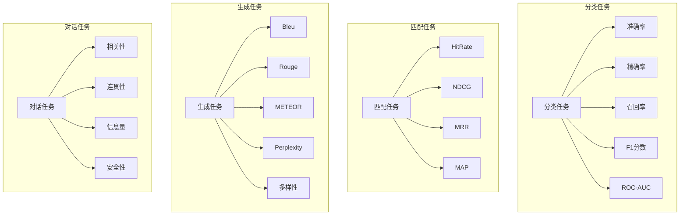
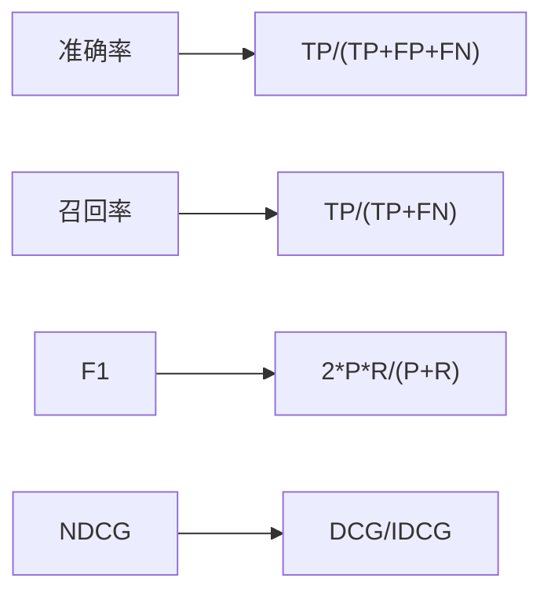

# 图9.3：效果评测详细指标

## 多任务评测指标

```mermaid
flowchart TD
    subgraph 分类任务
        A[分类任务] --> A1[准确率]
        A --> A2[精确率]
        A --> A3[召回率]
        A --> A4[F1分数]
        A --> A5[ROC-AUC]
    end
    
    subgraph 匹配任务
        B[匹配任务] --> B1[HitRate]
        B --> B2[NDCG]
        B --> B3[MRR]
        B --> B4[MAP]
    end
    
    subgraph 生成任务
        C[生成任务] --> C1[Bleu]
        C --> C2[Rouge]
        C --> C3[METEOR]
        C --> C4[Perplexity]
        C --> C5[多样性]
    end
    
    subgraph 对话任务
        D[对话任务] --> D1[相关性]
        D --> D2[连贯性]
        D --> D3[信息量]
        D --> D4[安全性]
    end
```

## 指标计算公式

```mermaid
flowchart LR
    A[准确率] --> A1["TP/(TP+FP+FN)"]
    B[召回率] --> B1["TP/(TP+FN)"]
    C[F1] --> C1["2*P*R/(P+R)"]
    D[NDCG] --> D1["DCG/IDCG"]
```
