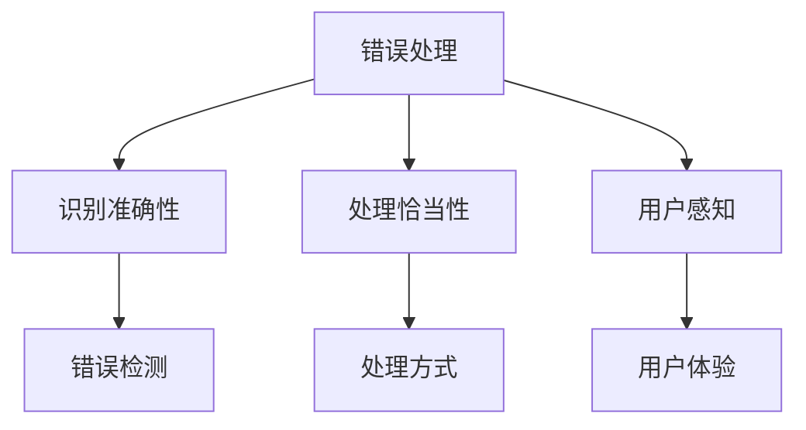
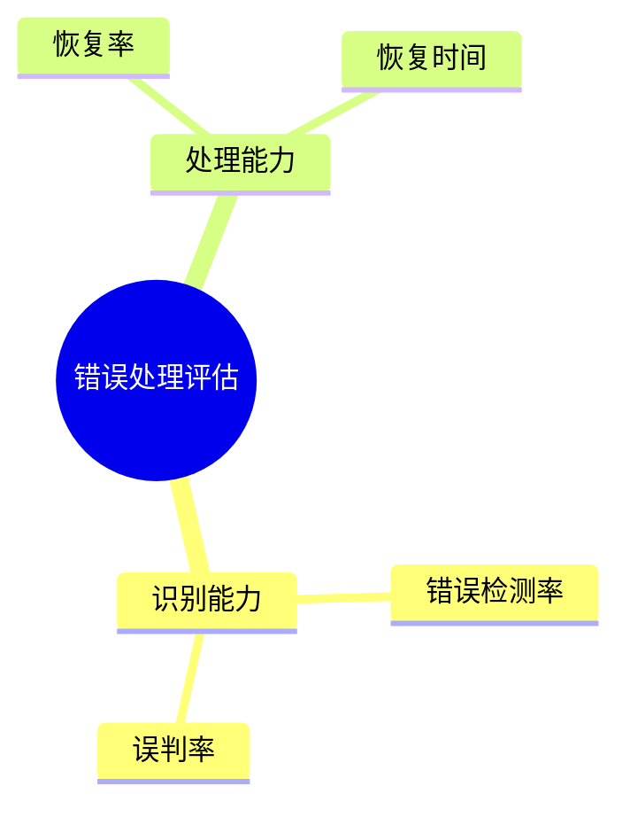

# 图9.34：错误处理评估

## 处理质量

```mermaid
flowchart TD
    A[错误处理] --> B[识别准确性]
    A --> C[处理恰当性]
    A --> D[用户感知]
    
    B --> B1[错误检测]
    C --> C1[处理方式]
    D --> D1[用户体验]
```

## 评估框架

```mermaid
mindmap
  root((错误处理评估))
    识别能力
      错误检测率
      误判率
    处理能力
      恢复率
      恢复时间
```
