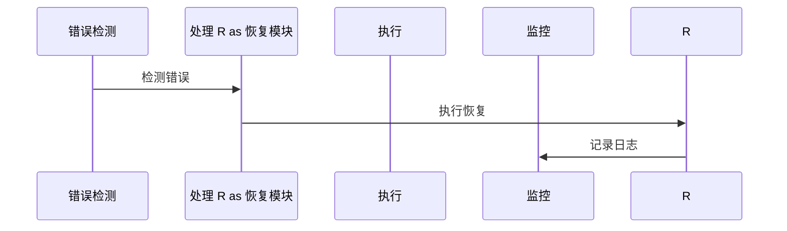
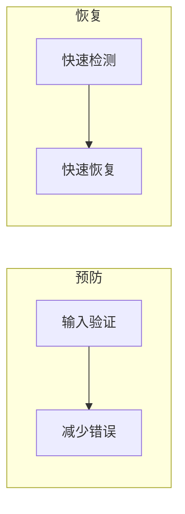

# 图9.35：错误恢复系统

## 系统架构

```mermaid
sequenceDiagram
    participant E as 错误检测
    participant H as 处理 R as 恢复模块
    participant执行
    participant M as 监控
    
    E->>H: 检测错误
    H->>R: 执行恢复
    R->>M: 记录日志
```

## 优化方向

```mermaid
flowchart LR
    subgraph 预防
        A[输入验证] --> D[减少错误]
    end
    
    subgraph 恢复
        B[快速检测] --> E[快速恢复]
    end
```
