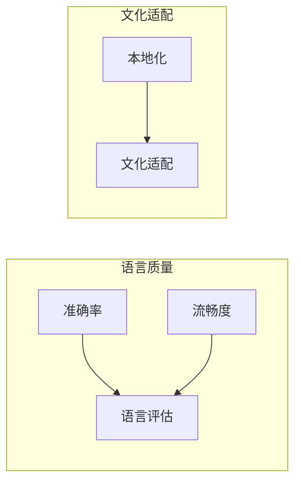
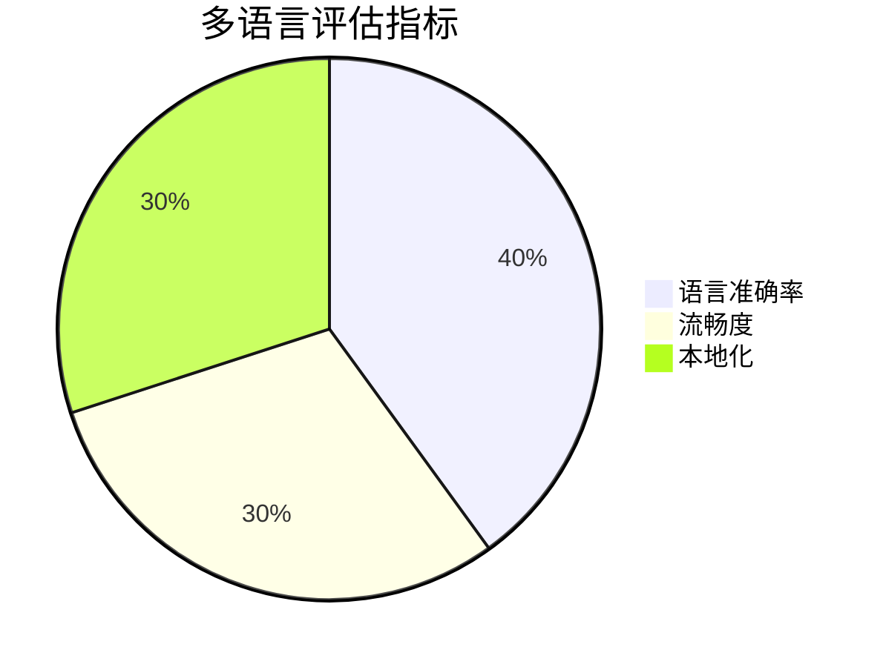

# 图9.37：多语言评估指标

## 评估维度

```mermaid
flowchart LR
    subgraph 语言质量
        A[准确率] --> D[语言评估]
        B[流畅度] --> D
    end
    
    subgraph 文化适配
        C[本地化] --> E[文化适配]
    end
```

## 语言指标

```mermaid
pie title 多语言评估指标
    "语言准确率" : 40
    "流畅度" : 30
    "本地化" : 30
```
