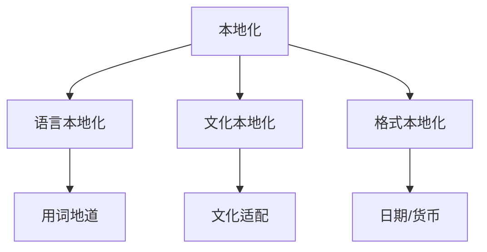
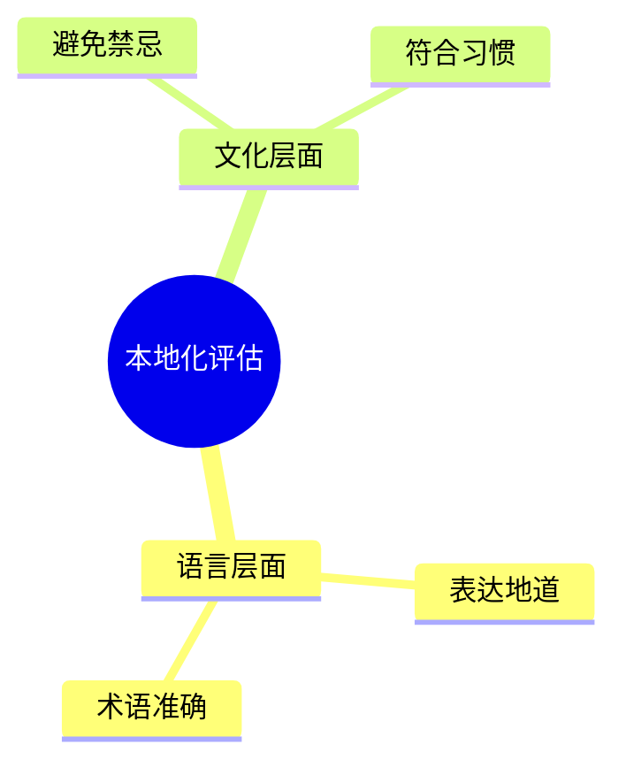

# 图9.39：本地化评估

## 本地化维度

```mermaid
flowchart TD
    A[本地化] --> B[语言本地化]
    A --> C[文化本地化]
    A --> D[格式本地化]
    
    B --> B1[用词地道]
    C --> C1[文化适配]
    D --> D1[日期/货币]
```

## 评估要点

```mermaid
mindmap
  root((本地化评估))
    语言层面
      表达地道
      术语准确
    文化层面
      避免禁忌
      符合习惯
```
