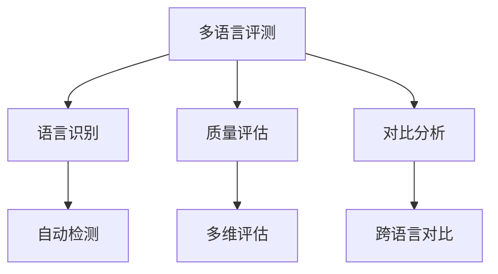
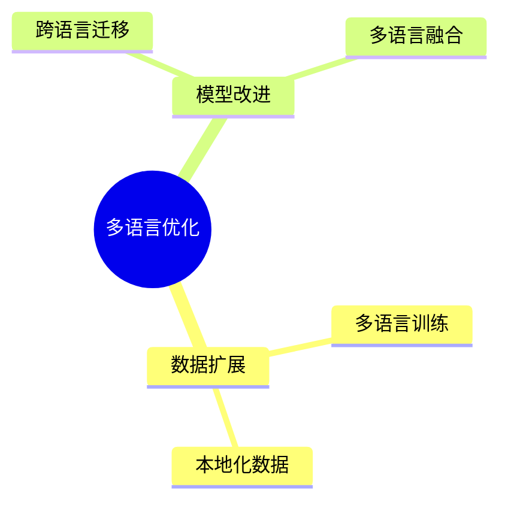

# 图9.40：多语言评测系统

## 评估系统

```mermaid
flowchart TD
    A[多语言评测] --> B[语言识别]
    A --> C[质量评估]
    A --> D[对比分析]
    
    B --> B1[自动检测]
    C --> C1[多维评估]
    D --> D2[跨语言对比]
```

## 优化策略

```mermaid
mindmap
  root((多语言优化))
    数据扩展
      多语言训练
      本地化数据
    模型改进
      跨语言迁移
      多语言融合
```
