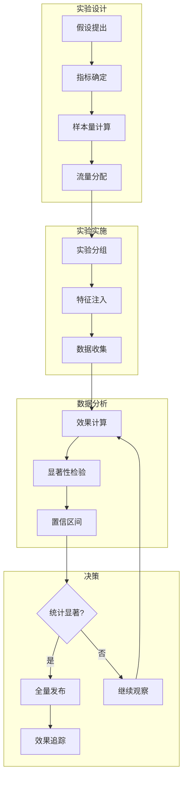
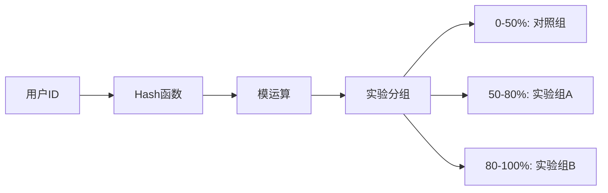

# 图9.4：A/B测试详细流程

## 实验设计与实施

```mermaid
flowchart TD
    subgraph 实验设计
        A[假设提出] --> B[指标确定]
        B --> C[样本量计算]
        C --> D[流量分配]
    end
    
    subgraph 实验实施
        D --> E[实验分组]
        E --> F[特征注入]
        F --> G[数据收集]
    end
    
    subgraph 数据分析
        G --> H[效果计算]
        H --> I[显著性检验]
        I --> J[置信区间]
    end
    
    subgraph 决策
        J --> K{统计显著?}
        K -->|是| L[全量发布]
        K -->|否| M[继续观察]
        M --> H
        L --> N[效果追踪]
    end
```

## 分流策略

```mermaid
flowchart LR
    A[用户ID] --> B[Hash函数]
    B --> C[模运算]
    C --> D[实验分组]
    
    D --> E[0-50%: 对照组]
    D --> F[50-80%: 实验组A]
    D --> G[80-100%: 实验组B]
```
