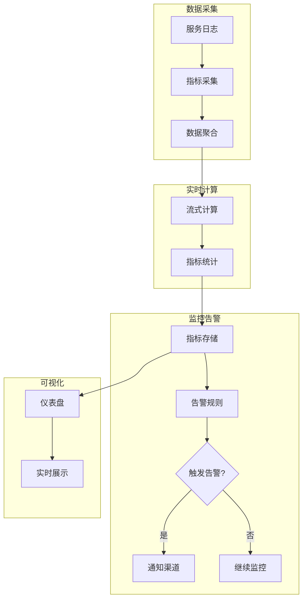
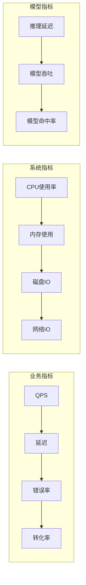

# 图9.5：在线监控体系

## 实时监控架构

```mermaid
flowchart TD
    subgraph 数据采集
        A[服务日志] --> B[指标采集]
        B --> C[数据聚合]
    end
    
    subgraph 实时计算
        C --> D[流式计算]
        D --> E[指标统计]
    end
    
    subgraph 监控告警
        E --> F[指标存储]
        F --> G[告警规则]
        G --> H{触发告警?}
        H -->|是| I[通知渠道]
        H -->|否| J[继续监控]
    end
    
    subgraph 可视化
        F --> K[仪表盘]
        K --> L[实时展示]
    end
```

## 核心监控指标

```mermaid
flowchart LR
    subgraph 业务指标
        A[QPS] --> D[延迟]
        D --> E[错误率]
        E --> F[转化率]
    end
    
    subgraph 系统指标
        G[CPU使用率] --> J[内存使用]
        J --> K[磁盘IO]
        K --> L[网络IO]
    end
    
    subgraph 模型指标
        M[推理延迟] --> P[模型吞吐]
        P --> Q[模型命中率]
    end
```
