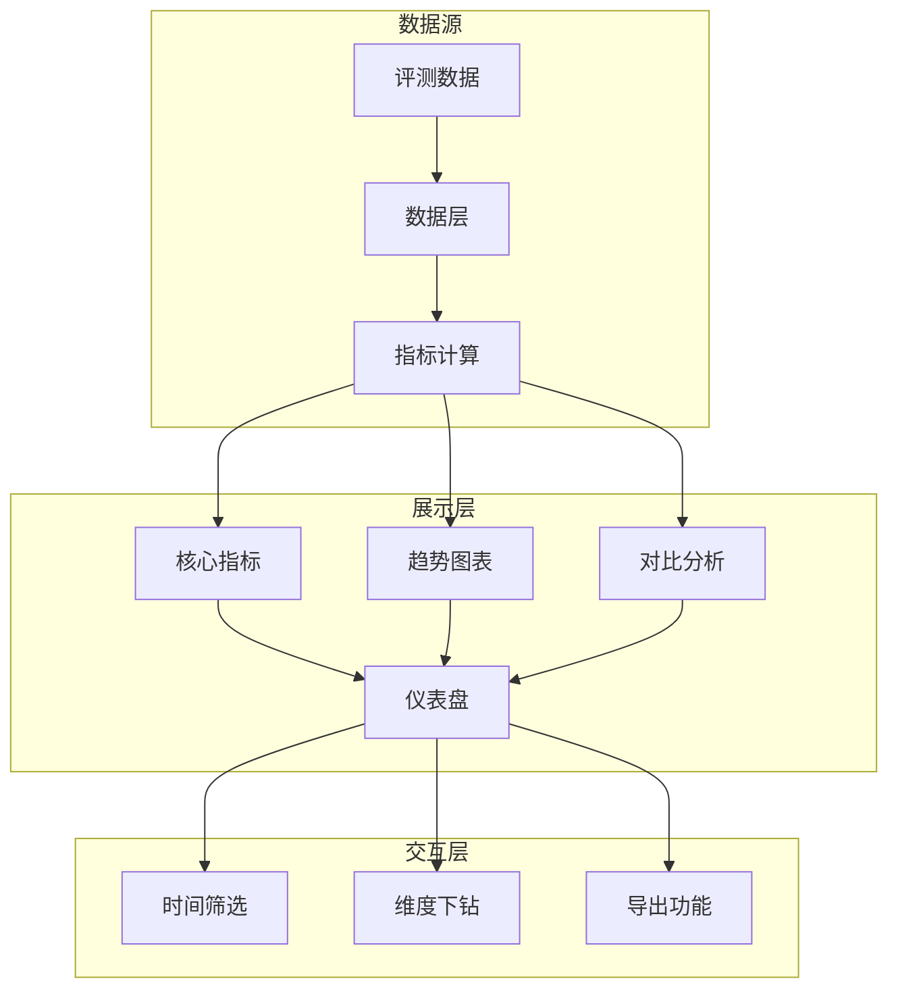

# 图9.6：评测仪表盘设计

## 仪表盘架构



## 关键指标展示

```mermaid
flowchart LR
指标] --> D    A[效果[质量评分]
    A --> E[准确率趋势]
    
    B[性能指标] --> F[延迟分布]
    B --> G[吞吐量趋势]
    
    C[业务指标] --> H[转化率]
    C --> I[用户满意度]
```
