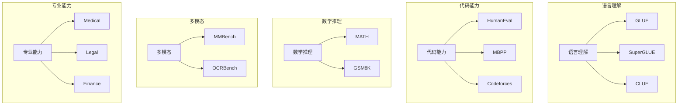
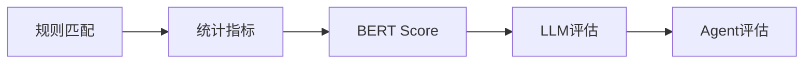

# 图9.7：评测基准与排行榜

## 主流评测基准

```mermaid
flowchart TD
    subgraph 语言理解
        A[语言理解] --> A1[GLUE]
        A --> A2[SuperGLUE]
        A --> A3[CLUE]
    end
    
    subgraph 代码能力
        B[代码能力] --> B1[HumanEval]
        B --> B2[MBPP]
        B --> B3[Codeforces]
    end
    
    subgraph 数学推理
        C[数学推理] --> C1[MATH]
        C --> C2[GSM8K]
    end
    
    subgraph 多模态
        D[多模态] --> D1[MMBench]
        D --> D2[OCRBench]
    end
    
    subgraph 专业能力
        E[专业能力] --> E1[Medical]
        E --> E2[Legal]
        E --> E3[Finance]
    end
```

## 评测标准演进

```mermaid
flowchart LR
    A[规则匹配] --> B[统计指标]
    B --> C[BERT Score]
    C --> D[LLM评估]
    D --> E[Agent评估]
```
