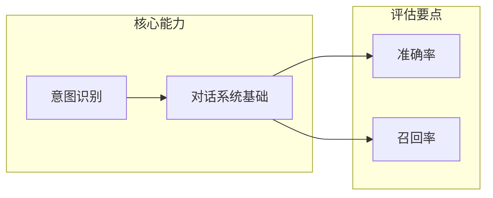
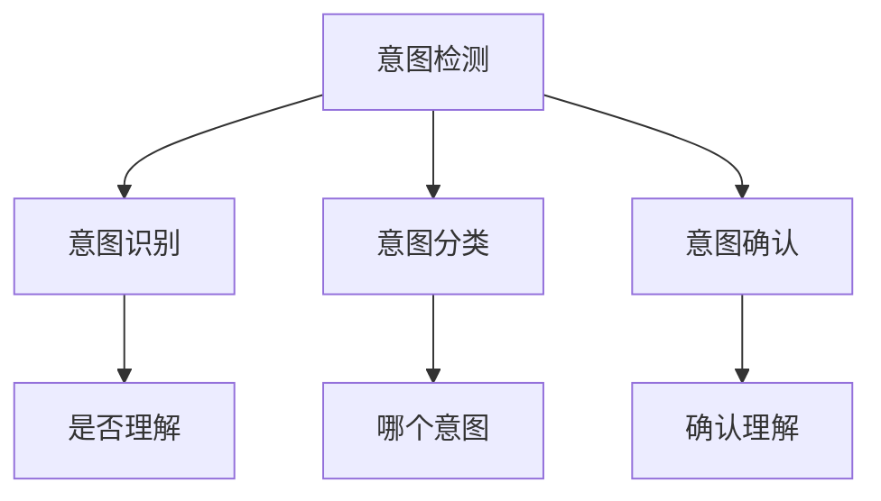

# 图9.1：意图检测评测——用户意图识别

## 评测目标

```mermaid
flowchart LR
    subgraph 核心能力
        A[意图识别] --> D[对话系统基础]
    end
    
    subgraph 评估要点
        D --> E[准确率]
        D --> F[召回率]
    end
```

## 评测维度

```mermaid
flowchart TD
    A[意图检测] --> B[意图识别]
    A --> C[意图分类]
    A --> D[意图确认]
    
    B --> B1[是否理解]
    C --> C1[哪个意图]
    D --> D2[确认理解]
```
