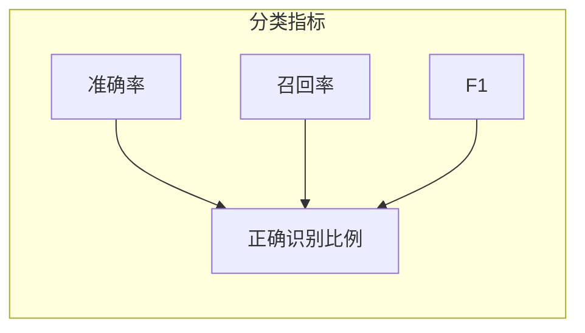
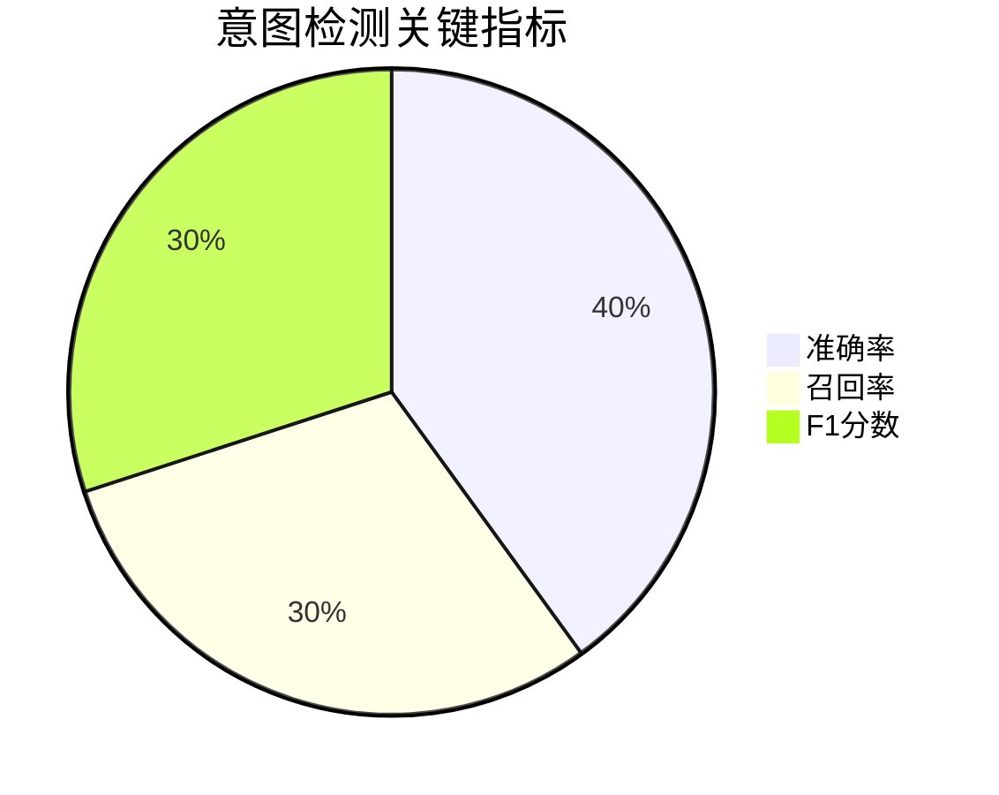

# 图9.2：意图检测指标

## 核心指标

```mermaid
flowchart LR
    subgraph 分类指标
        A[准确率] --> D[正确识别比例]
        B[召回率] --> D
        C[F1] --> D
    end
```

## 评估方法

```mermaid
pie title 意图检测关键指标
    "准确率" : 40
    "召回率" : 30
    "F1分数" : 30
```
