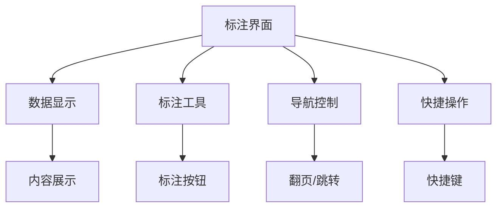

# 图10.3：标注界面设计

## 界面要素

```mermaid
flowchart TD
    A[标注界面] --> B[数据显示]
    A --> C[标注工具]
    A --> D[导航控制]
    A --> E[快捷操作]
    
    B --> B1[内容展示]
    C --> C1[标注按钮]
    D --> D1[翻页/跳转]
    E --> E1[快捷键]
```
