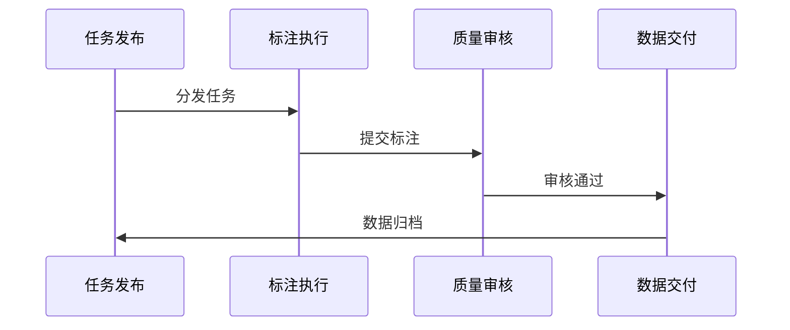

# 图10.4：平台工作流程

## 业务流程

```mermaid
sequenceDiagram
    participant A as 任务发布
    participant B as 标注执行
    participant C as 质量审核
    participant D as 数据交付
    
    A->>B: 分发任务
    B->>C: 提交标注
    C->>D: 审核通过
    D->>A: 数据归档
```
