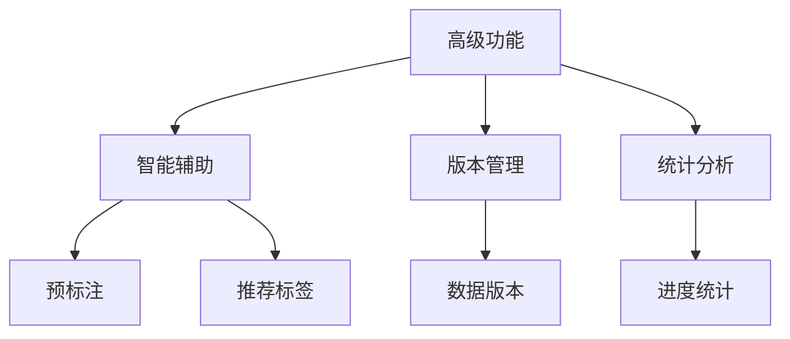
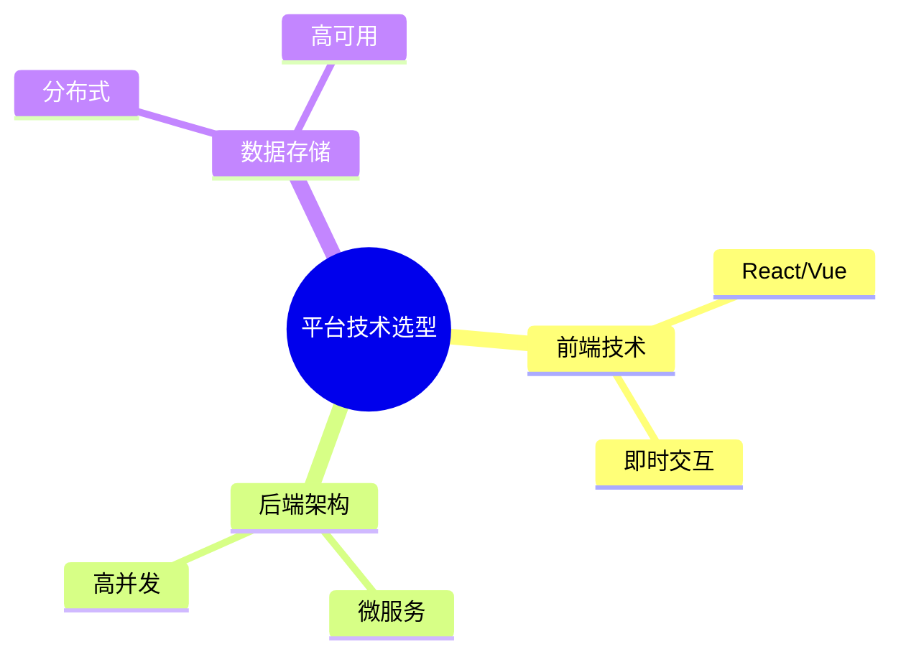

# 图10.5：平台高级功能

## 高级特性

```mermaid
flowchart TD
    A[高级功能] --> B[智能辅助]
    A --> C[版本管理]
    A --> D[统计分析]
    
    B --> B1[预标注]
    B --> B2[推荐标签]
    C --> C1[数据版本]
    D --> D1[进度统计]
```

## 技术选型

```mermaid
mindmap
  root((平台技术选型))
    前端技术
      React/Vue
      即时交互
    后端架构
      微服务
      高并发
    数据存储
      分布式
      高可用
```
