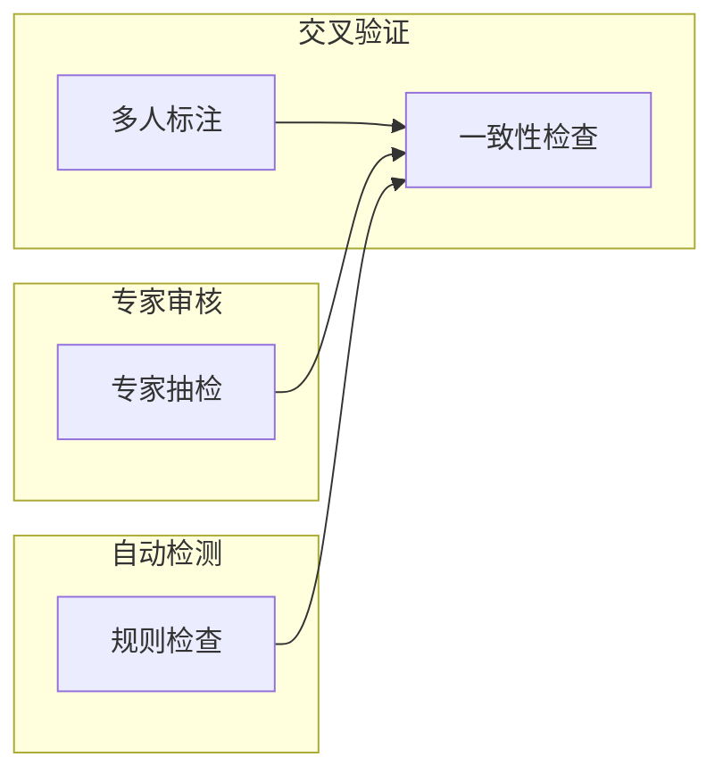
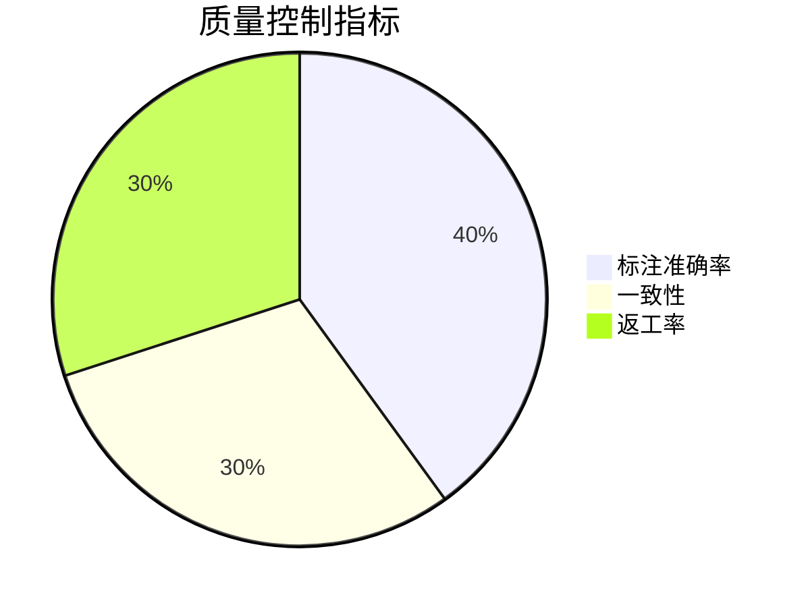

# 图10.7：质控方法

## 质控手段

```mermaid
flowchart LR
    subgraph 交叉验证
        A[多人标注] --> D[一致性检查]
    end
    
    subgraph 专家审核
        B[专家抽检] --> D
    end
    
    subgraph 自动检测
        C[规则检查] --> D
    end
```

## 质控指标

```mermaid
pie title 质量控制指标
    "标注准确率" : 40
    "一致性" : 30
    "返工率" : 30
```
