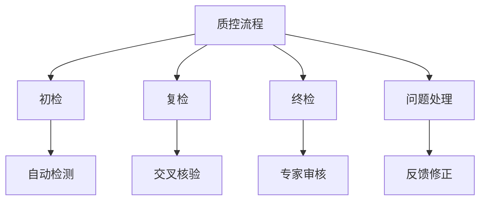

# 图10.8：质控流程详解

## 流程步骤

```mermaid
flowchart TD
    A[质控流程] --> B[初检]
    A --> C[复检]
    A --> D[终检]
    A --> E[问题处理]
    
    B --> B1[自动检测]
    C --> C1[交叉核验]
    D --> D2[专家审核]
    E --> E1[反馈修正]
```
