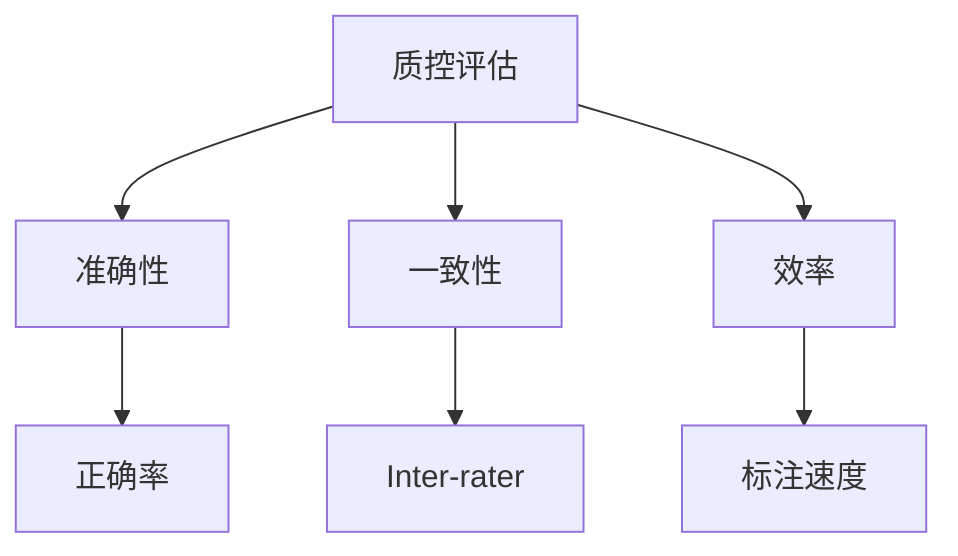
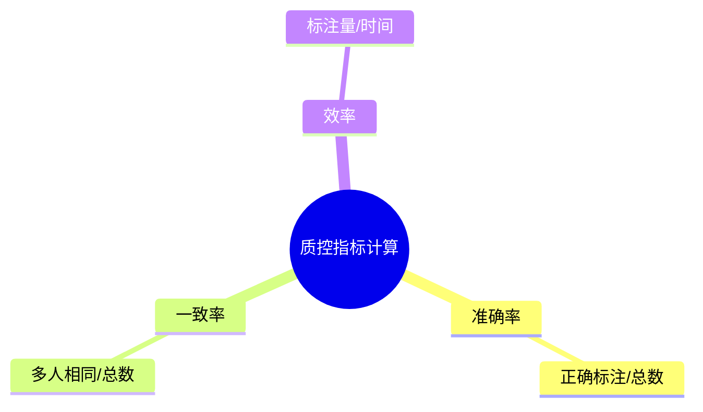

# 图10.9：质控评估指标

## 评估维度

```mermaid
flowchart TD
    A[质控评估] --> B[准确性]
    A --> C[一致性]
    A --> D[效率]
    
    B --> B1[正确率]
    C --> C1[Inter-rater]
    D --> D1[标注速度]
```

## 计算方法

```mermaid
mindmap
  root((质控指标计算))
    准确率
      正确标注/总数
    一致率
      多人相同/总数
    效率
      标注量/时间
```
