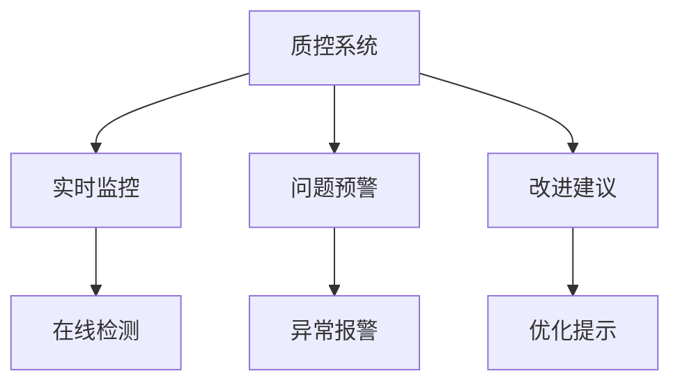
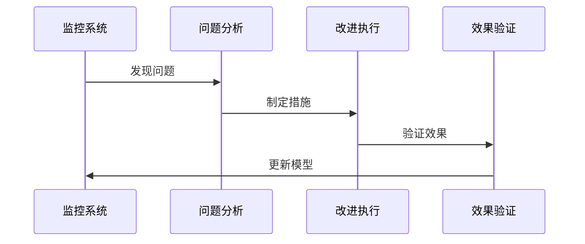

# 图10.10：质量控制系统

## 系统架构

```mermaid
flowchart TD
    A[质控系统] --> B[实时监控]
    A --> C[问题预警]
    A --> D[改进建议]
    
    B --> B1[在线检测]
    C --> C1[异常报警]
    D --> D1[优化提示]
```

## 反馈机制

```mermaid
sequenceDiagram
    participant M as 监控系统
    participant A as 问题分析
    participant I as 改进执行
    participant V as 效果验证
    
    M->>A: 发现问题
    A->>I: 制定措施
    I->>V: 验证效果
    V->>M: 更新模型
```
