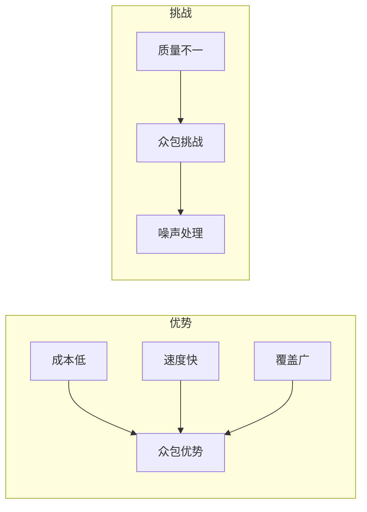
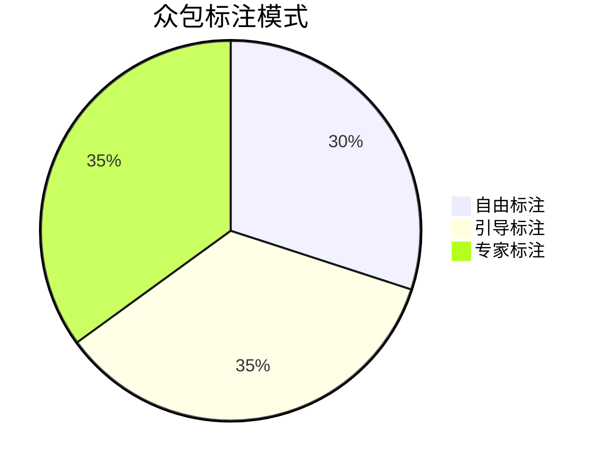

# 图10.11：众包标注模式

## 众包特点

```mermaid
flowchart LR
    subgraph 优势
        A[成本低] --> D[众包优势]
        B[速度快] --> D
        C[覆盖广] --> D
    end
    
    subgraph 挑战
        E[质量不一] --> F[众包挑战]
        F --> G[噪声处理]
    end
```

## 标注模式

```mermaid
pie title 众包标注模式
    "自由标注" : 30
    "引导标注" : 35
    "专家标注" : 35
```
