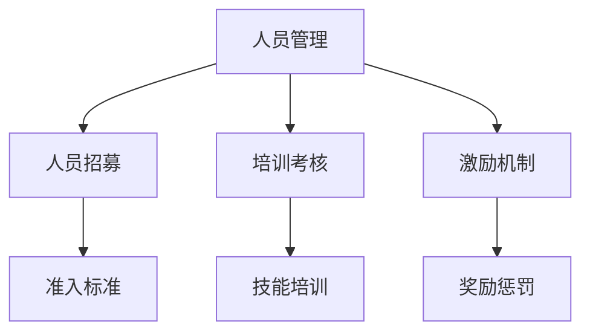
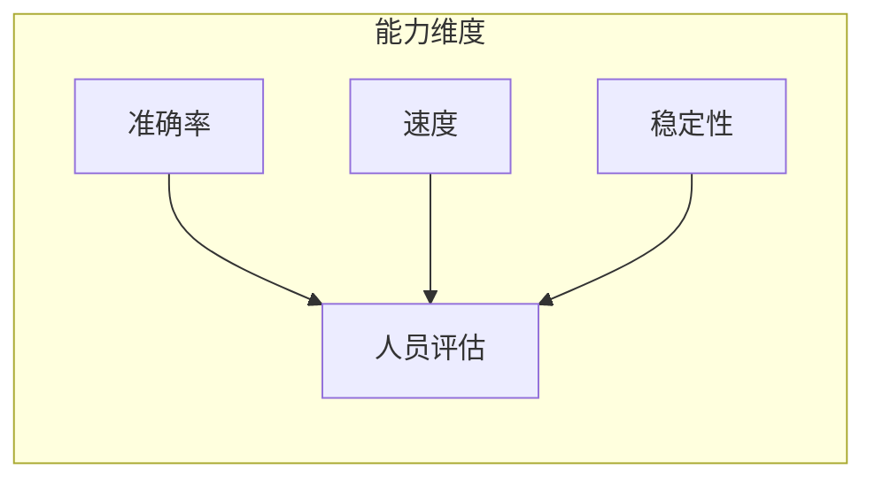

# 图10.12：标注人员管理

## 人员体系

```mermaid
flowchart TD
    A[人员管理] --> B[人员招募]
    A --> C[培训考核]
    A --> D[激励机制]
    
    B --> B1[准入标准]
    C --> C1[技能培训]
    D --> D1[奖励惩罚]
```

## 能力评估

```mermaid
flowchart LR
    subgraph 能力维度
        A[准确率] --> D[人员评估]
        B[速度] --> D
        C[稳定性] --> D
    end
```
