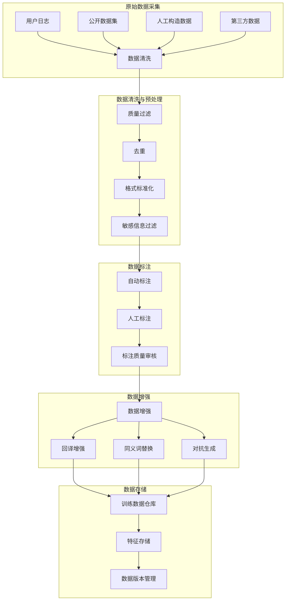
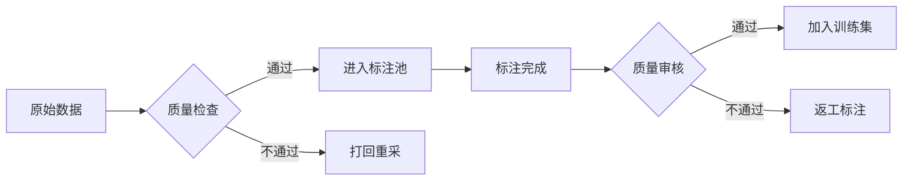

# 图10.1：数据构建流程

## 数据闭环全貌

数据构建是LLM服务的核心基础设施，本图展示从原始数据到训练数据的完整 pipeline：

```mermaid
flowchart TD
    subgraph 原始数据采集
        A[用户日志] --> D[数据清洗]
        B[公开数据集] --> D
        C[人工构造数据] --> D
        E[第三方数据] --> D
    end
    
    subgraph 数据清洗与预处理
        D --> F[质量过滤]
        F --> G[去重]
        G --> H[格式标准化]
        H --> I[敏感信息过滤]
    end
    
    subgraph 数据标注
        I --> J[自动标注]
        J --> K[人工标注]
        K --> L[标注质量审核]
    end
    
    subgraph 数据增强
        L --> M[数据增强]
        M --> N[回译增强]
        M --> O[同义词替换]
        M --> P[对抗生成]
    end
    
    subgraph 数据存储
        N --> Q[训练数据仓库]
        O --> Q
        P --> Q
        Q --> R[特征存储]
        R --> S[数据版本管理]
    end
```

## 数据质量控制门禁

```mermaid
flowchart LR
    A[原始数据] --> B{质量检查}
    B -->|通过| C[进入标注池]
    B -->|不通过| D[打回重采]
    C --> E[标注完成]
    E --> F{质量审核}
    F -->|通过| G[加入训练集]
    F -->|不通过| H[返工标注]
```
