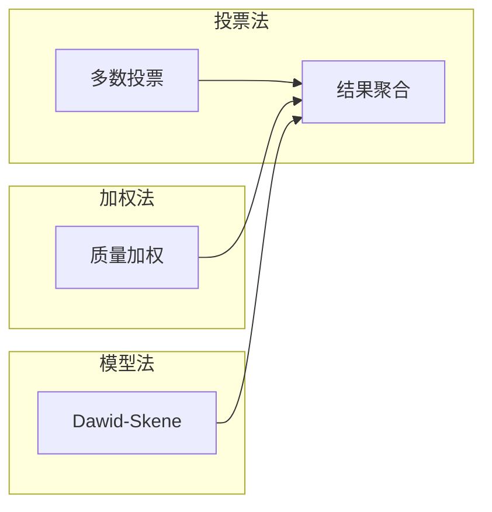
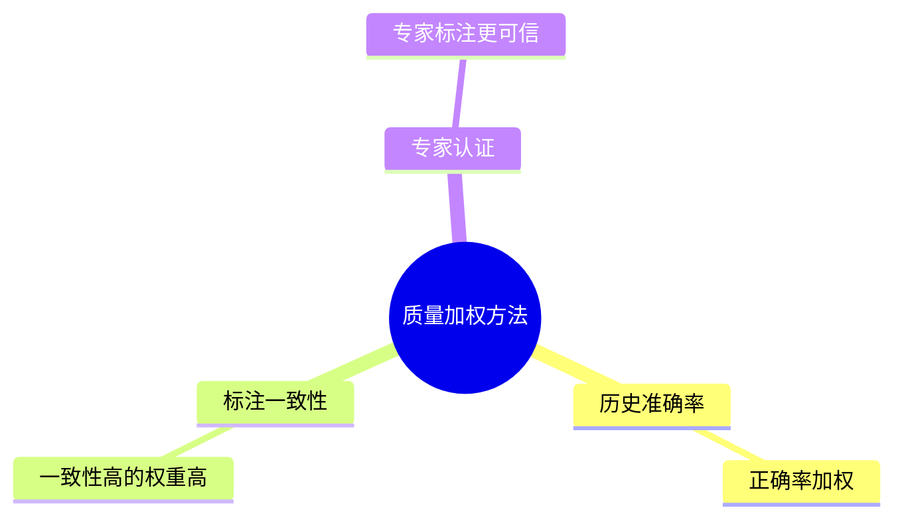

# 图10.13：质量聚合方法

## 聚合算法

```mermaid
flowchart LR
    subgraph 投票法
        A[多数投票] --> D[结果聚合]
    end
    
    subgraph 加权法
        B[质量加权] --> D
    end
    
    subgraph 模型法
        C[Dawid-Skene] --> D
    end
```

## 质量加权

```mermaid
mindmap
  root((质量加权方法))
    历史准确率
      正确率加权
    标注一致性
      一致性高的权重高
    专家认证
      专家标注更可信
```
