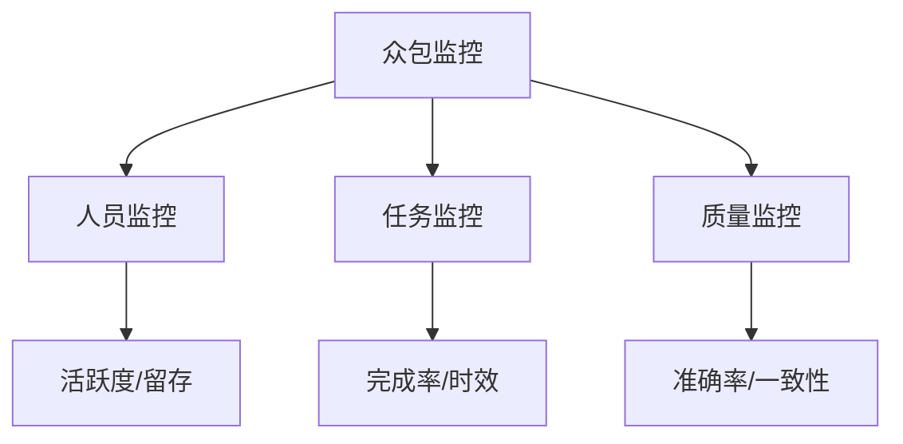
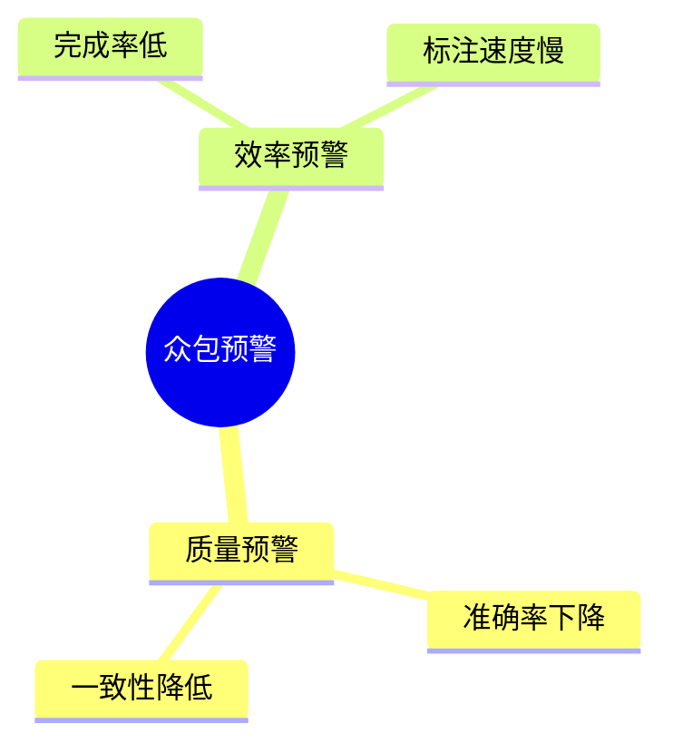

# 图10.15：众包监控体系

## 监控指标

```mermaid
flowchart TD
    A[众包监控] --> B[人员监控]
    A --> C[任务监控]
    A --> D[质量监控]
    
    B --> B1[活跃度/留存]
    C --> C1[完成率/时效]
    D --> D2[准确率/一致性]
```

## 预警机制

```mermaid
mindmap
  root((众包预警))
    质量预警
      准确率下降
      一致性降低
    效率预警
      完成率低
      标注速度慢
```
