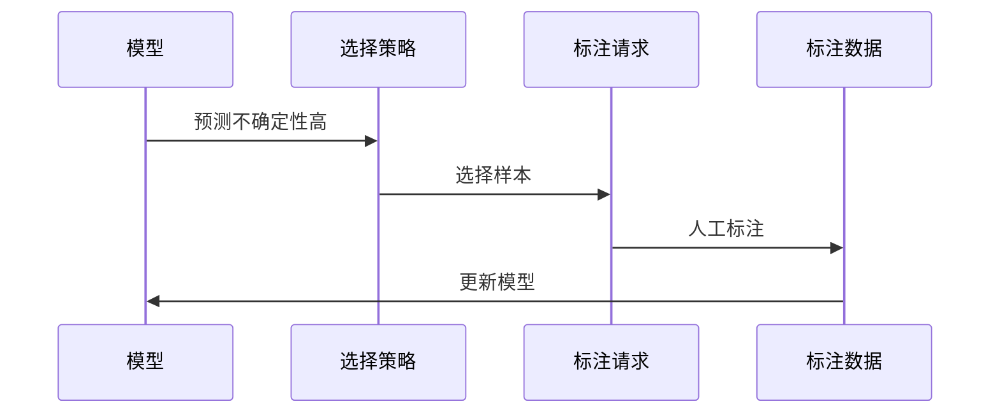
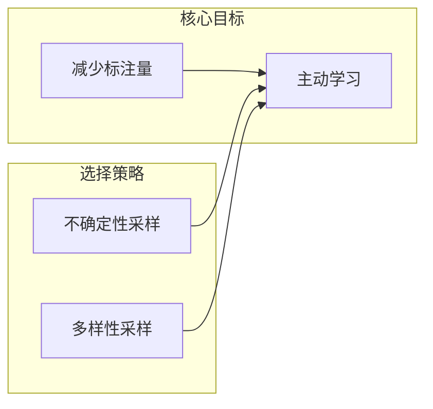

# 图10.16：主动学习流程

## 学习循环

```mermaid
sequenceDiagram
    participant M as 模型
    participant S as 选择策略
    participant A as 标注请求
    participant L as 标注数据
    
    M->>S: 预测不确定性高
    S->>A: 选择样本
    A->>L: 人工标注
    L->>M: 更新模型
```

## 核心思想

```mermaid
flowchart LR
    subgraph 核心目标
        A[减少标注量] --> D[主动学习]
    end
    
    subgraph 选择策略
        B[不确定性采样] --> D
        C[多样性采样] --> D
    end
```
