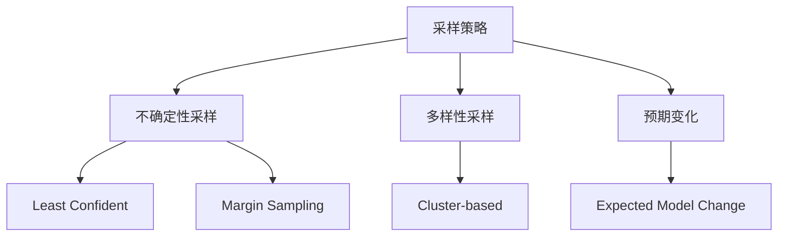
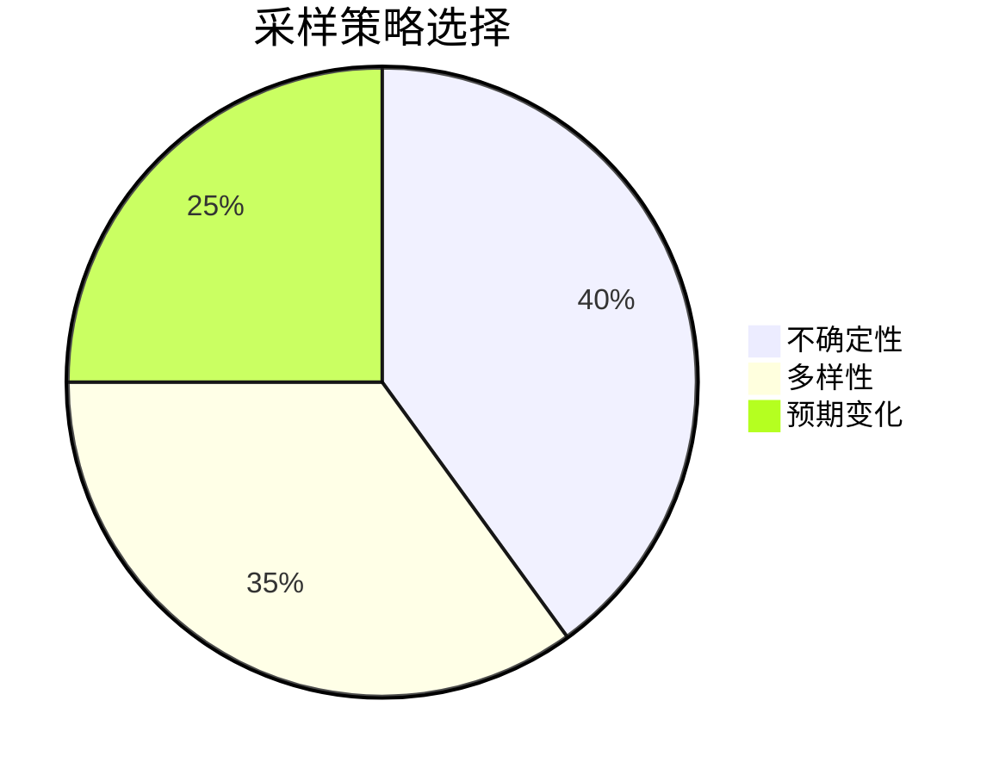

# 图10.17：采样策略

## 策略类型

```mermaid
flowchart TD
    A[采样策略] --> B[不确定性采样]
    A --> C[多样性采样]
    A --> D[预期变化]
    
    B --> B1[Least Confident]
    B --> B2[Margin Sampling]
    C --> C1[Cluster-based]
    D --> D2[Expected Model Change]
```

## 策略对比

```mermaid
pie title 采样策略选择
    "不确定性" : 40
    "多样性" : 35
    "预期变化" : 25
```
