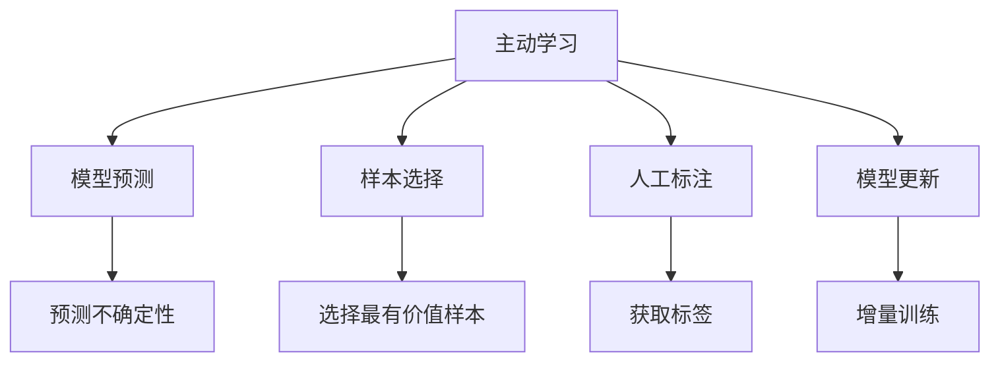

# 图10.18：主动学习循环

## 迭代流程

```mermaid
flowchart TD
    A[主动学习] --> B[模型预测]
    A --> C[样本选择]
    A --> D[人工标注]
    A --> E[模型更新]
    
    B --> B1[预测不确定性]
    C --> C1[选择最有价值样本]
    D --> D1[获取标签]
    E --> D2[增量训练]
```
