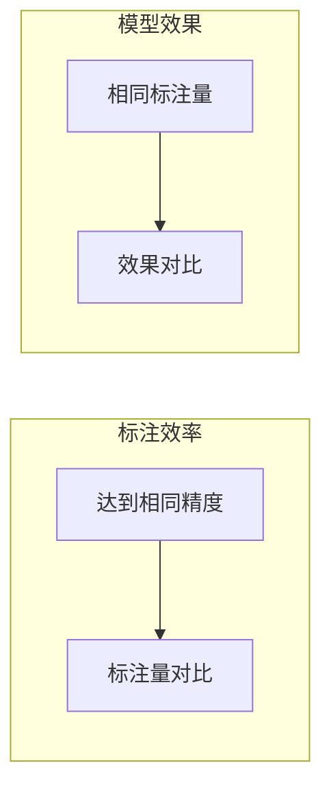
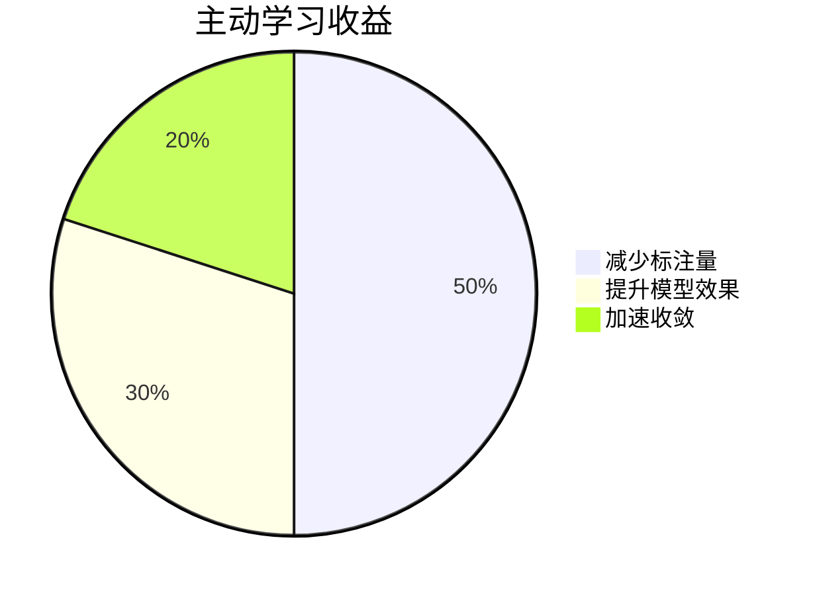

# 图10.19：主动学习效果评估

## 评估指标

```mermaid
flowchart LR
    subgraph 标注效率
        A[达到相同精度] --> D[标注量对比]
    end
    
    subgraph 模型效果
        B[相同标注量] --> E[效果对比]
    end
```

## 对比基准

```mermaid
pie title 主动学习收益
    "减少标注量" : 50
    "提升模型效果" : 30
    "加速收敛" : 20
```
