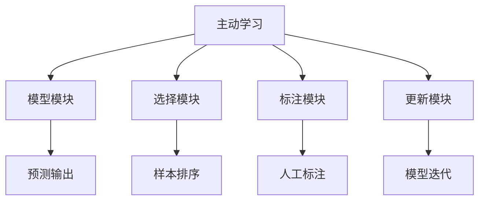
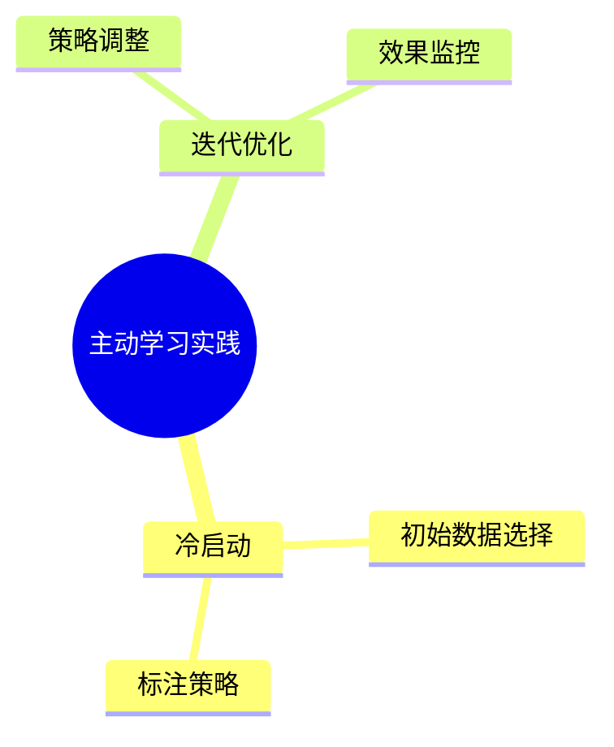

# 图10.20：主动学习系统

## 系统架构

```mermaid
flowchart TD
    A[主动学习] --> B[模型模块]
    A --> C[选择模块]
    A --> D[标注模块]
    A --> E[更新模块]
    
    B --> B1[预测输出]
    C --> C1[样本排序]
    D --> D1[人工标注]
    E --> D2[模型迭代]
```

## 实践要点

```mermaid
mindmap
  root((主动学习实践))
    冷启动
      初始数据选择
      标注策略
    迭代优化
      策略调整
      效果监控
```
