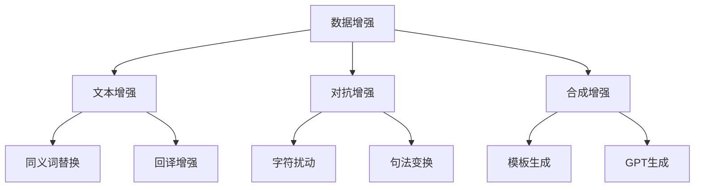

# 图10.21：数据增强方法

## 增强类型

```mermaid
flowchart TD
    A[数据增强] --> B[文本增强]
    A --> C[对抗增强]
    A --> D[合成增强]
    
    B --> B1[同义词替换]
    B --> B2[回译增强]
    
    C --> C1[字符扰动]
    C --> C2[句法变换]
    
    D --> D1[模板生成]
    D --> D2[GPT生成]
```
