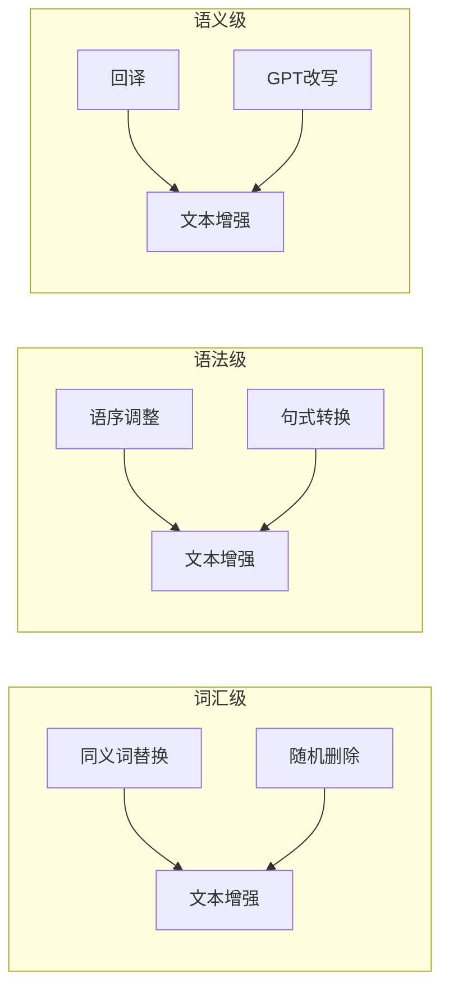

# 图10.22：文本增强技术

## 方法分类

```mermaid
flowchart LR
    subgraph 词汇级
        A[同义词替换] --> D[文本增强]
        B[随机删除] --> D
    end
    
    subgraph 语法级
        C[语序调整] --> E[文本增强]
        D1[句式转换] --> E
    end
    
    subgraph 语义级
        E1[回译] --> F[文本增强]
        E2[GPT改写] --> F
    end
```
