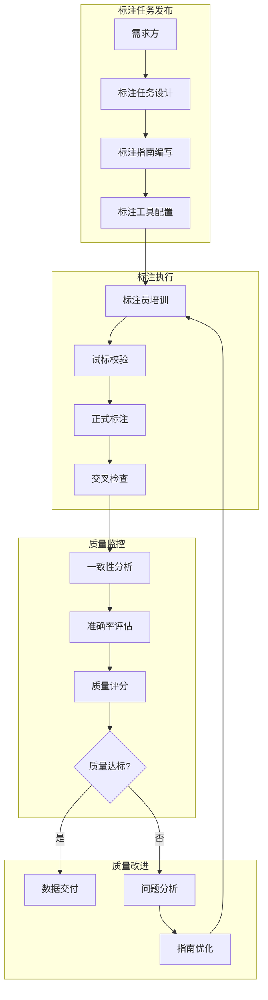
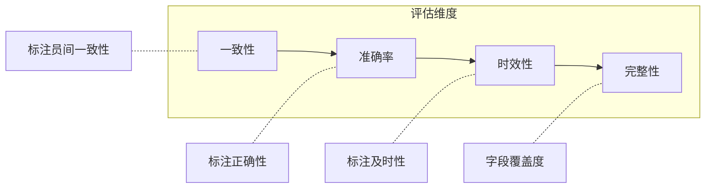

# 图10.2：标注质量管理流程

## 标注质量保障体系

高质量标注数据是模型性能的关键保障：

```mermaid
flowchart TD
    subgraph 标注任务发布
        A[需求方] --> B[标注任务设计]
        B --> C[标注指南编写]
        C --> D[标注工具配置]
    end
    
    subgraph 标注执行
        D --> E[标注员培训]
        E --> F[试标校验]
        F --> G[正式标注]
        G --> H[交叉检查]
    end
    
    subgraph 质量监控
        H --> I[一致性分析]
        I --> J[准确率评估]
        J --> K[质量评分]
        K --> L{质量达标?}
    end
    
    subgraph 质量改进
        L -->|是| M[数据交付]
        L -->|否| N[问题分析]
        N --> O[指南优化]
        O --> E
    end
```

## 标注质量评估指标

```mermaid
flowchart LR
    subgraph 评估维度
        A[一致性] --> B[准确率] --> C[时效性] --> D[完整性]
    end
    
    A1[标注员间一致性] -.- A
    B1[标注正确性] -.- B
    C1[标注及时性] -.- C
    D1[字段覆盖度] -.- D
```
