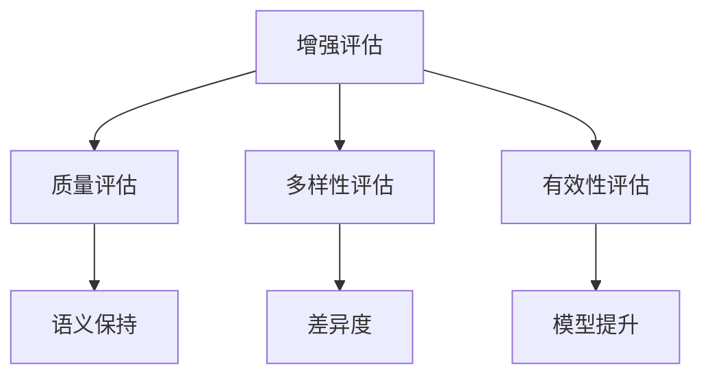
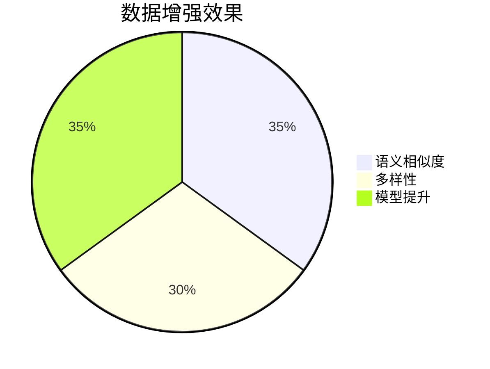

# 图10.23：增强效果评估

## 评估维度

```mermaid
flowchart TD
    A[增强评估] --> B[质量评估]
    A --> C[多样性评估]
    A --> D[有效性评估]
    
    B --> B1[语义保持]
    C --> C1[差异度]
    D --> D1[模型提升]
```

## 评估指标

```mermaid
pie title 数据增强效果
    "语义相似度" : 35
    "多样性" : 30
    "模型提升" : 35
```
