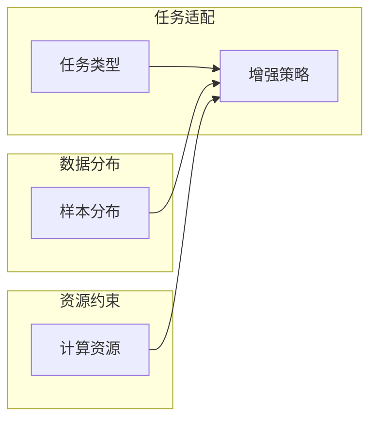
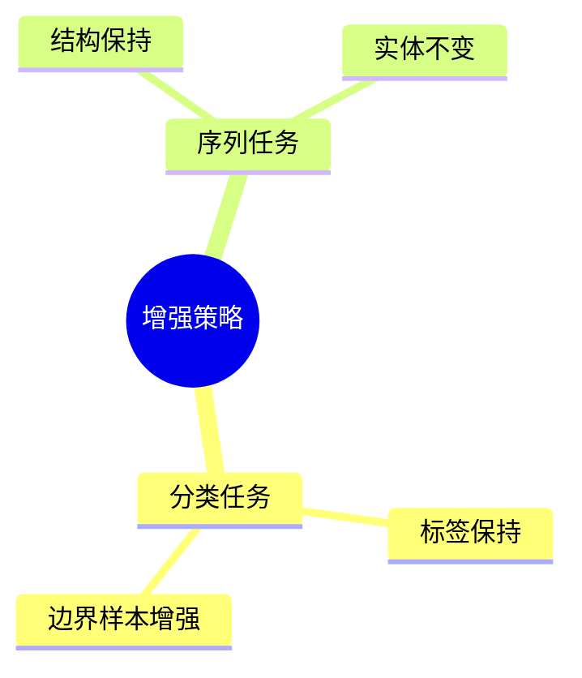

# 图10.24：增强策略选择

## 策略框架

```mermaid
flowchart LR
    subgraph 任务适配
        A[任务类型] --> D[增强策略]
    end
    
    subgraph 数据分布
        B[样本分布] --> D
    end
    
    subgraph 资源约束
        C[计算资源] --> D
    end
```

## 任务适配

```mermaid
mindmap
  root((增强策略))
    分类任务
      标签保持
      边界样本增强
    序列任务
      结构保持
      实体不变
```
