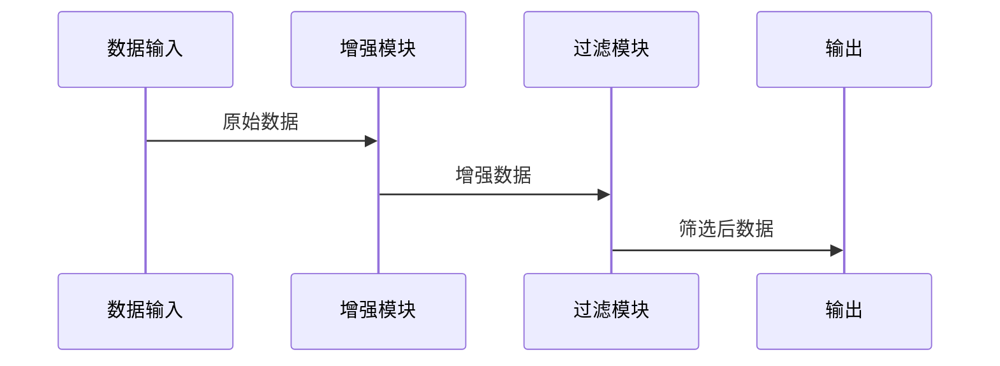
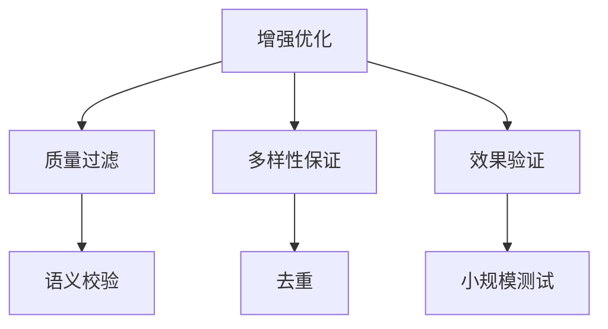

# 图10.25：数据增强系统

## 系统设计

```mermaid
sequenceDiagram
    participant D as 数据输入
    participant A as 增强模块
    participant F as 过滤模块
    participant O as 输出
    
    D->>A: 原始数据
    A->>F: 增强数据
    F->>O: 筛选后数据
```

## 优化流程

```mermaid
flowchart TD
    A[增强优化] --> B[质量过滤]
    A --> C[多样性保证]
    A --> D[效果验证]
    
    B --> B1[语义校验]
    C --> C1[去重]
    D --> D2[小规模测试]
```
