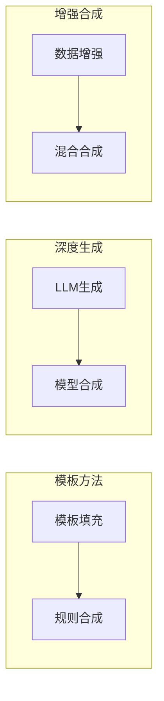
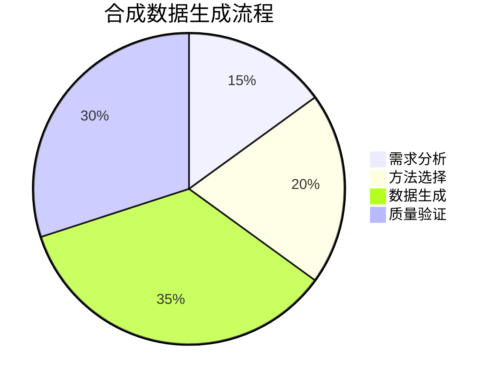

# 图10.27：生成技术

## 技术分类

```mermaid
flowchart LR
    subgraph 模板方法
        A[模板填充] --> D[规则合成]
    end
    
    subgraph 深度生成
        B[LLM生成] --> E[模型合成]
    end
    
    subgraph 增强合成
        C[数据增强] --> F[混合合成]
    end
```

## 生成流程

```mermaid
pie title 合成数据生成流程
    "需求分析" : 15
    "方法选择" : 20
    "数据生成" : 35
    "质量验证" : 30
```
