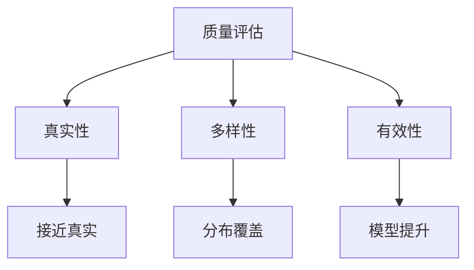
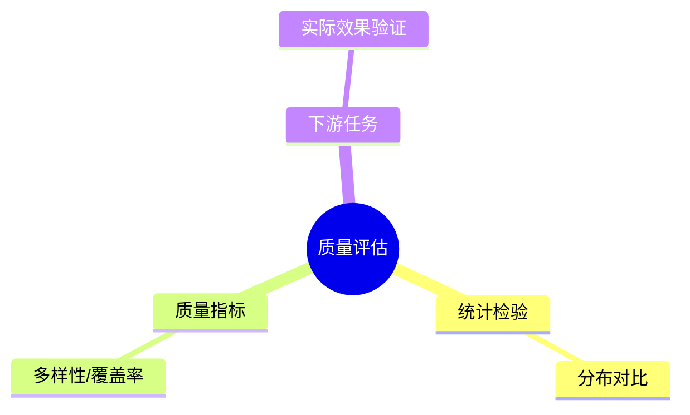

# 图10.28：合成数据质量

## 质量评估

```mermaid
flowchart TD
    A[质量评估] --> B[真实性]
    A --> C[多样性]
    A --> D[有效性]
    
    B --> B1[接近真实]
    C --> C1[分布覆盖]
    D --> D1[模型提升]
```

## 评估方法

```mermaid
mindmap
  root((质量评估))
    统计检验
      分布对比
    质量指标
      多样性/覆盖率
    下游任务
      实际效果验证
```
