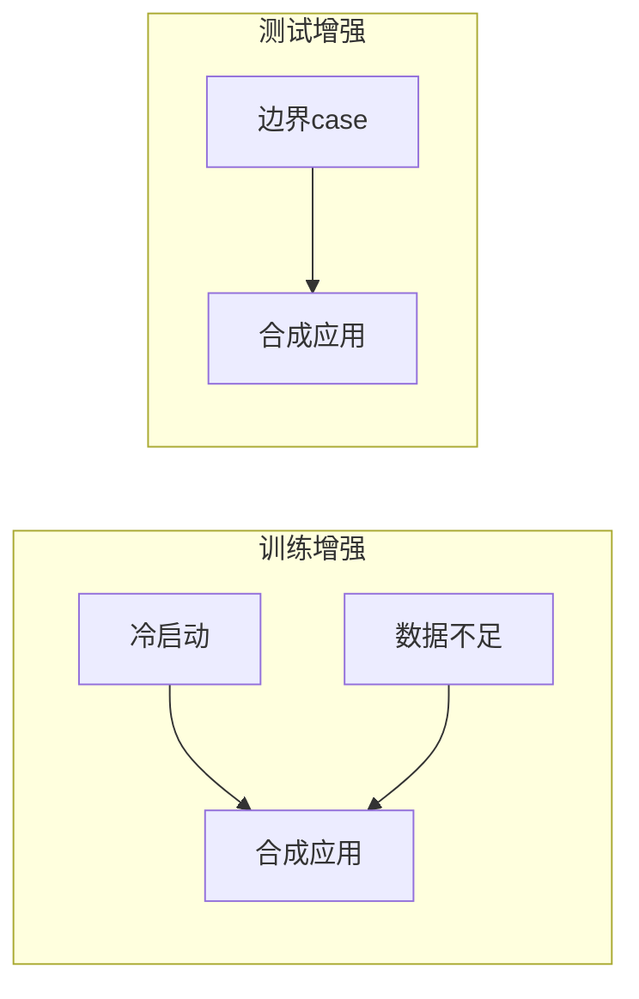
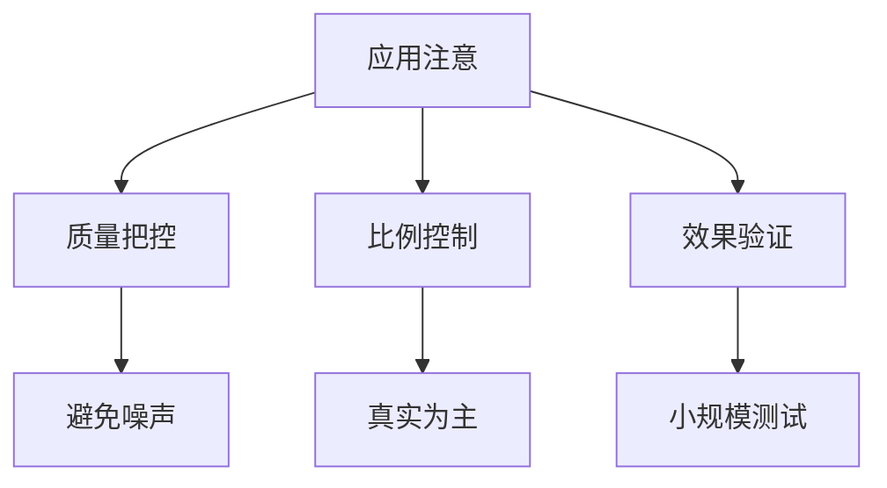

# 图10.29：合成数据应用

## 应用场景

```mermaid
flowchart LR
    subgraph 训练增强
        A[冷启动] --> D[合成应用]
        B[数据不足] --> D
    end
    
    subgraph 测试增强
        C[边界case] --> E[合成应用]
    end
```

## 注意事项

```mermaid
flowchart TD
    A[应用注意] --> B[质量把控]
    A --> C[比例控制]
    A --> D[效果验证]
    
    B --> B1[避免噪声]
    C --> C1[真实为主]
    D --> D2[小规模测试]
```
