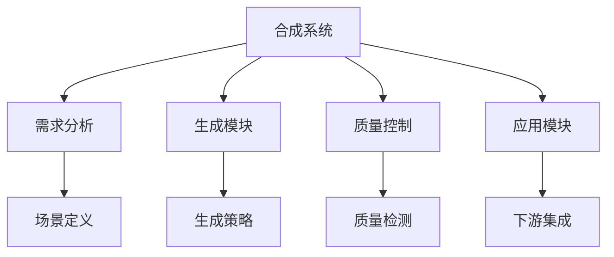
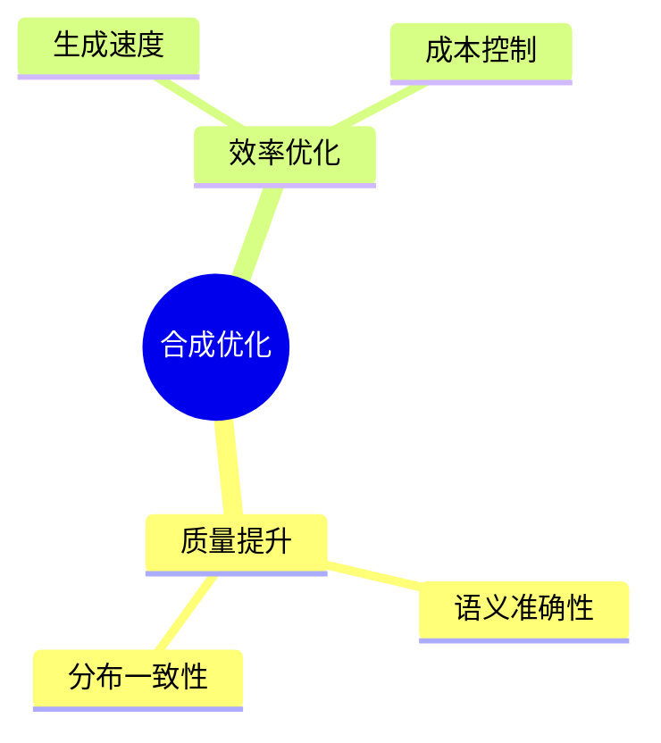

# 图10.30：合成数据系统

## 系统架构

```mermaid
flowchart TD
    A[合成系统] --> B[需求分析]
    A --> C[生成模块]
    A --> D[质量控制]
    A --> E[应用模块]
    
    B --> B1[场景定义]
    C --> C1[生成策略]
    D --> D1[质量检测]
    E --> D2[下游集成]
```

## 优化方向

```mermaid
mindmap
  root((合成优化))
    质量提升
      语义准确性
      分布一致性
    效率优化
      生成速度
      成本控制
```
