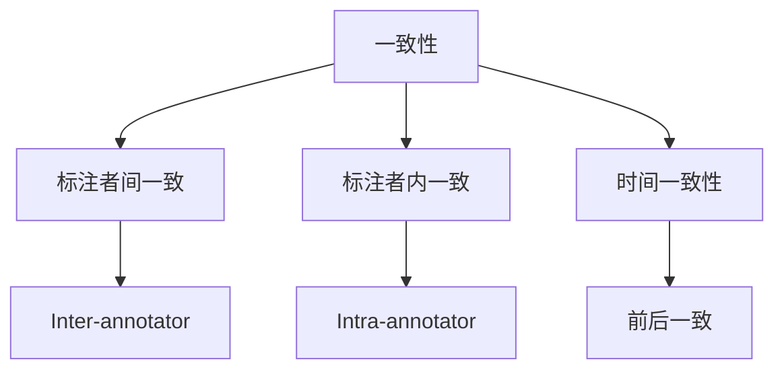

# 图10.31：标注一致性计算

## 一致性类型

```mermaid
flowchart TD
    A[一致性] --> B[标注者间一致]
    A --> C[标注者内一致]
    A --> D[时间一致性]
    
    B --> B1[Inter-annotator]
    C --> C1[Intra-annotator]
    D --> D1[前后一致]
```
