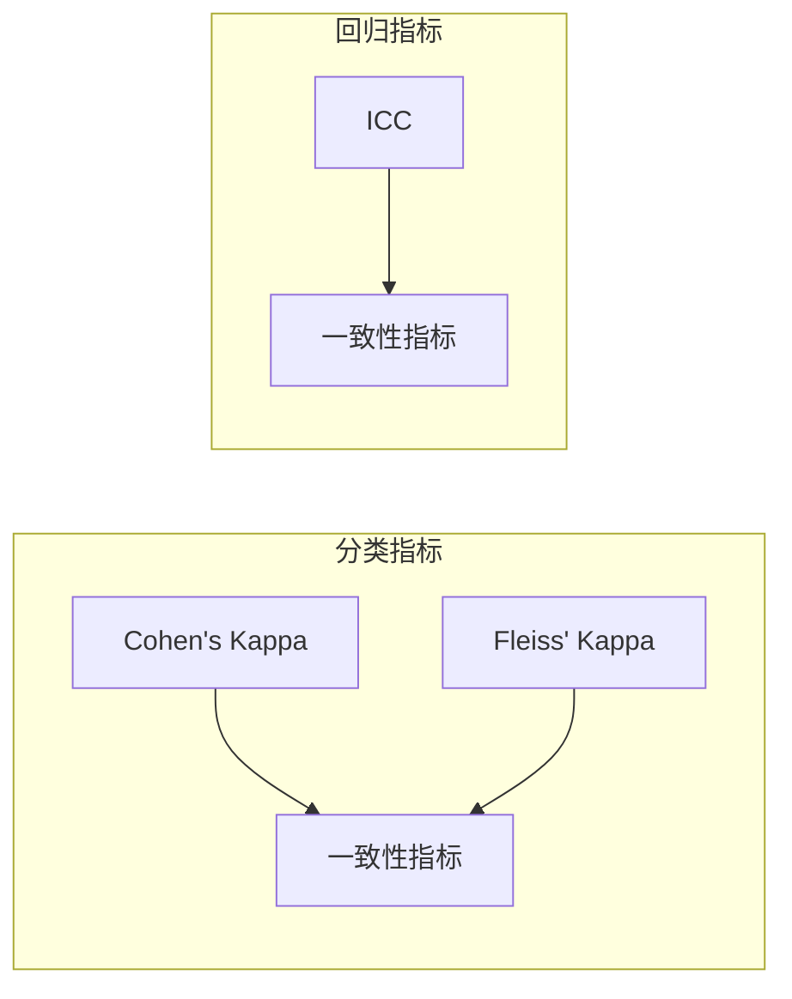
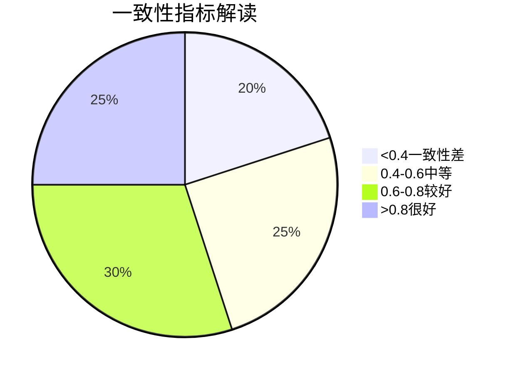

# 图10.32：一致性指标

## 计算指标

```mermaid
flowchart LR
    subgraph 分类指标
        A[Cohen's Kappa] --> D[一致性指标]
        B[Fleiss' Kappa] --> D
    end
    
    subgraph 回归指标
        C[ICC] --> E[一致性指标]
    end
```

## 指标解读

```mermaid
pie title 一致性指标解读
    "<0.4一致性差" : 20
    "0.4-0.6中等" : 25
    "0.6-0.8较好" : 30
    ">0.8很好" : 25
```
