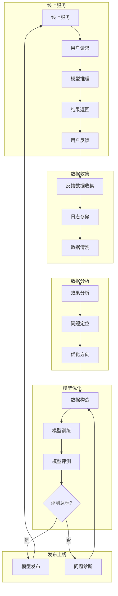
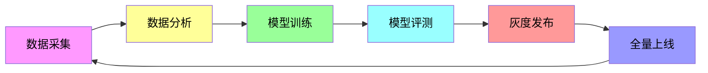

# 图10.3：闭环迭代流程

## 数据-模型闭环迭代

持续优化是保持竞争力的关键，本图展示完整的闭环迭代机制：

```mermaid
flowchart TD
    subgraph 线上服务
        A[线上服务] --> B[用户请求]
        B --> C[模型推理]
        C --> D[结果返回]
        D --> E[用户反馈]
    end
    
    subgraph 数据收集
        E --> F[反馈数据收集]
        F --> G[日志存储]
        G --> H[数据清洗]
    end
    
    subgraph 数据分析
        H --> I[效果分析]
        I --> J[问题定位]
        J --> K[优化方向]
    end
    
    subgraph 模型优化
        K --> L[数据构造]
        L --> M[模型训练]
        M --> N[模型评测]
        N --> O{评测达标?}
    end
    
    subgraph 发布上线
        O -->|是| P[模型发布]
        O -->|否| Q[问题诊断]
        Q --> L
        P --> A
    end
```

## 迭代周期管理

```mermaid
flowchart LR
    A[数据采集] --> B[数据分析]
    B --> C[模型训练]
    C --> D[模型评测]
    D --> E[灰度发布]
    E --> F[全量上线]
    F --> A
    
    style A fill:#f9f,color:#000
    style B fill:#ff9,color:#000
    style C fill:#9f9,color:#000
    style D fill:#9ff,color:#000
    style E fill:#f99,color:#000
    style F fill:#99f,color:#000
```
