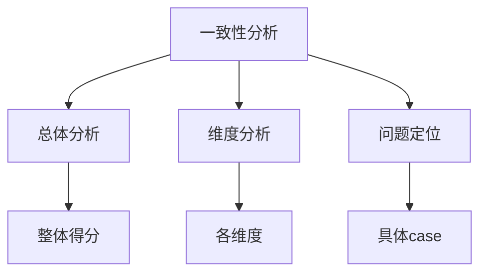
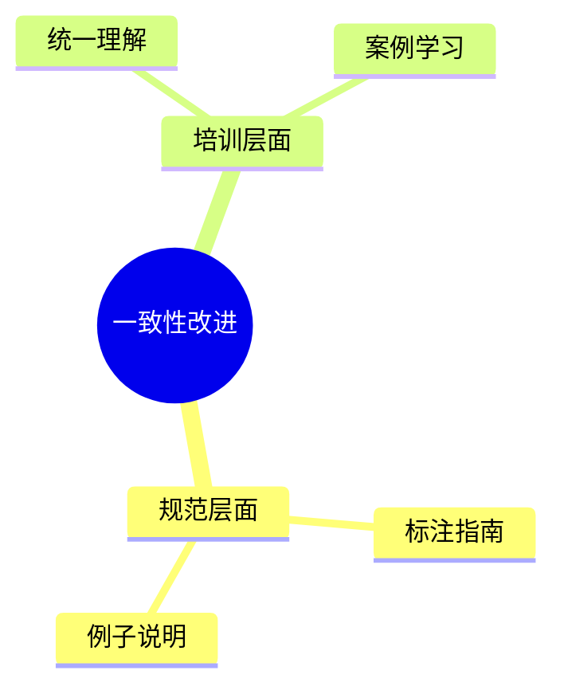

# 图10.33：一致性分析

## 分析方法

```mermaid
flowchart TD
    A[一致性分析] --> B[总体分析]
    A --> C[维度分析]
    A --> D[问题定位]
    
    B --> B1[整体得分]
    C --> C1[各维度]
    D --> D1[具体case]
```

## 改进方向

```mermaid
mindmap
  root((一致性改进))
    规范层面
      标注指南
      例子说明
    培训层面
      统一理解
      案例学习
```
