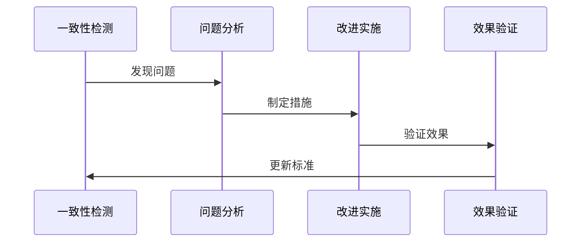
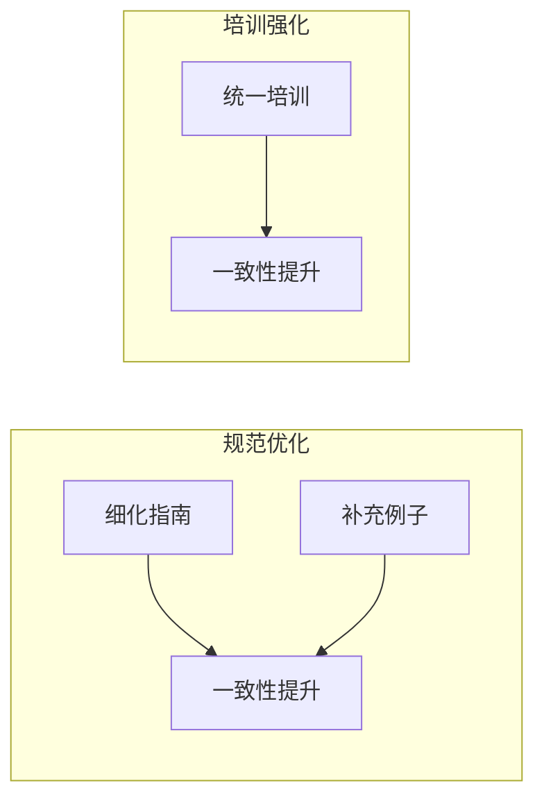

# 图10.34：一致性改进

## 改进流程

```mermaid
sequenceDiagram
    participant C as 一致性检测
    participant A as 问题分析
    participant I as 改进实施
    participant V as 效果验证
    
    C->>A: 发现问题
    A->>I: 制定措施
    I->>V: 验证效果
    V->>C: 更新标准
```

## 措施类型

```mermaid
flowchart LR
    subgraph 规范优化
        A[细化指南] --> D[一致性提升]
        B[补充例子] --> D
    end
    
    subgraph 培训强化
        C[统一培训] --> E[一致性提升]
    end
```
