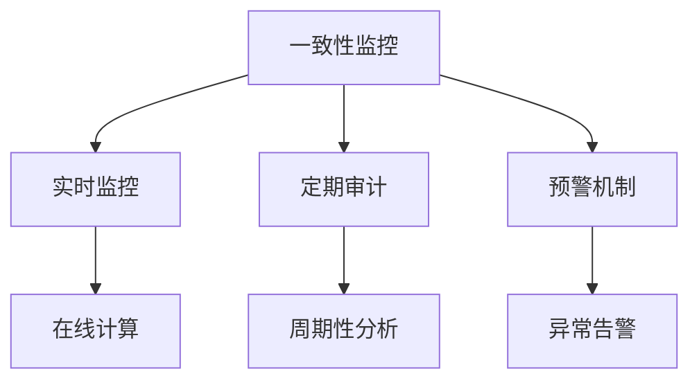
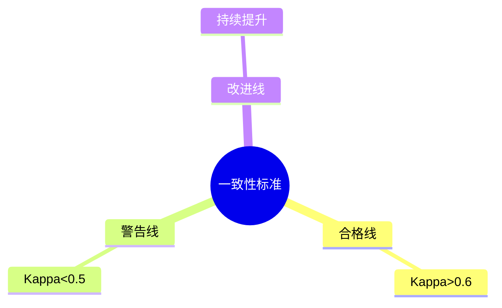

# 图10.35：一致性监控

## 监控体系

```mermaid
flowchart TD
    A[一致性监控] --> B[实时监控]
    A --> C[定期审计]
    A --> D[预警机制]
    
    B --> B1[在线计算]
    C --> C1[周期性分析]
    D --> D1[异常告警]
```

## 评估标准

```mermaid
mindmap
  root((一致性标准))
    合格线
      Kappa>0.6
    警告线
      Kappa<0.5
    改进线
      持续提升
```
