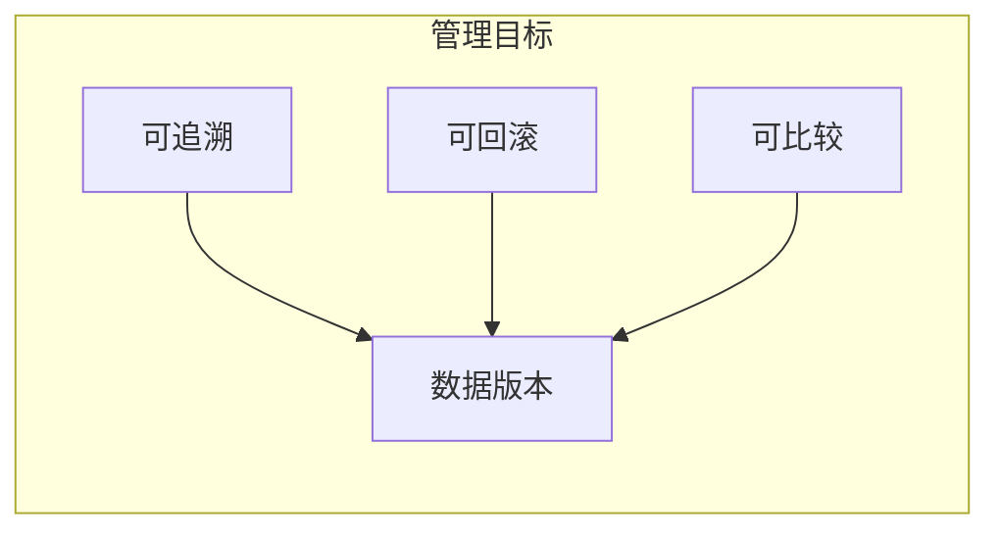
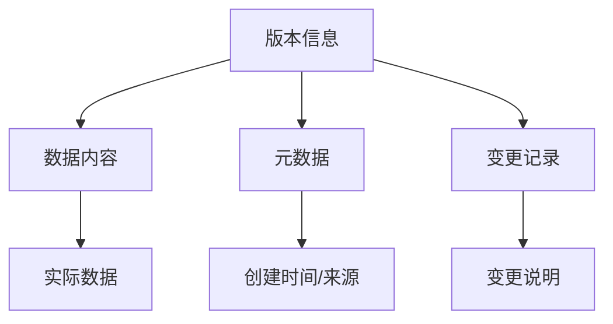

# 图10.36：数据版本管理

## 版本管理需求

```mermaid
flowchart LR
    subgraph 管理目标
        A[可追溯] --> D[数据版本]
        B[可回滚] --> D
        C[可比较] --> D
    end
```

## 版本要素

```mermaid
flowchart TD
    A[版本信息] --> B[数据内容]
    A --> C[元数据]
    A --> D[变更记录]
    
    B --> B1[实际数据]
    C --> C1[创建时间/来源]
    D --> D1[变更说明]
```
