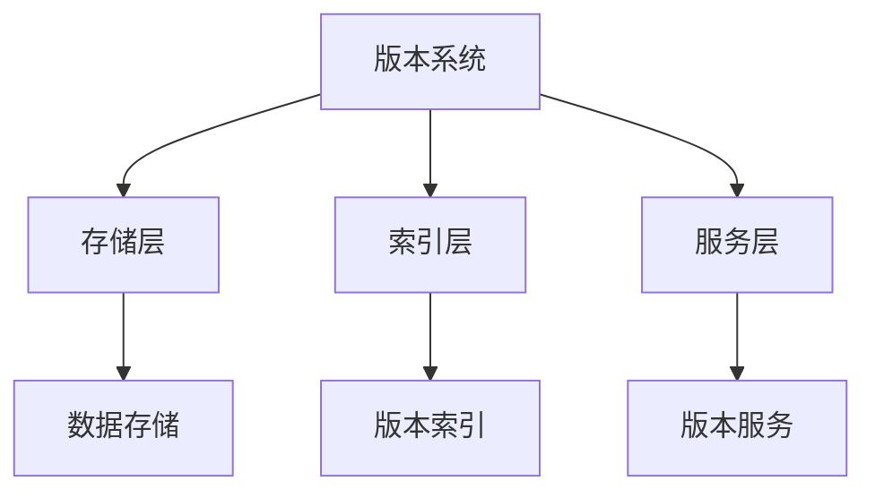
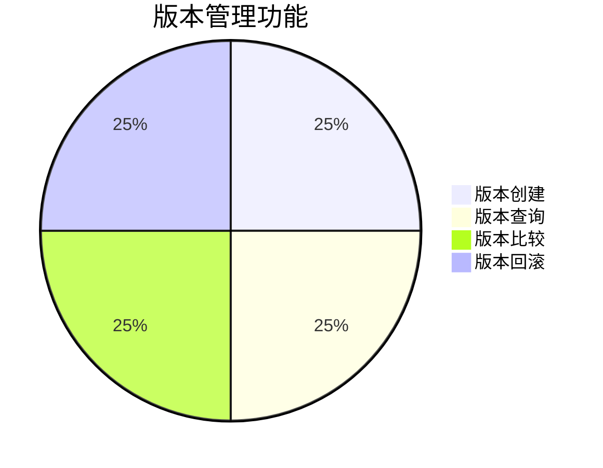

# 图10.37：版本管理系统

## 系统架构

```mermaid
flowchart TD
    A[版本系统] --> B[存储层]
    A --> C[索引层]
    A --> D[服务层]
    
    B --> B1[数据存储]
    C --> C1[版本索引]
    D --> D1[版本服务]
```

## 核心功能

```mermaid
pie title 版本管理功能
    "版本创建" : 25
    "版本查询" : 25
    "版本比较" : 25
    "版本回滚" : 25
```
