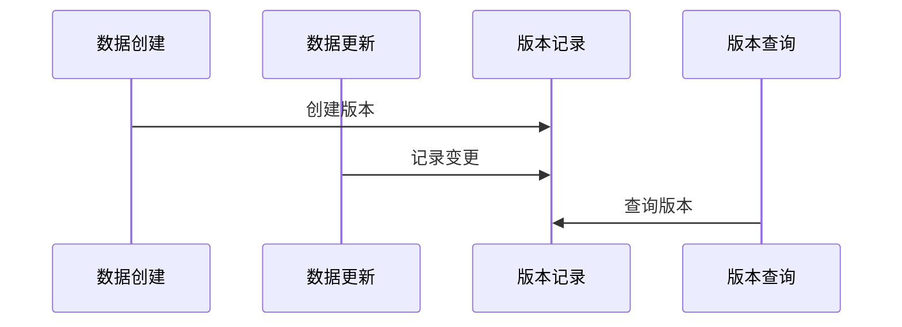

# 图10.38：版本追踪

## 追踪机制

```mermaid
sequenceDiagram
    participant C as 数据创建
    participant U as 数据更新
    participant V as 版本记录
    participant Q as 版本查询
    
    C->>V: 创建版本
    U->>V: 记录变更
    Q->>V: 查询版本
```
