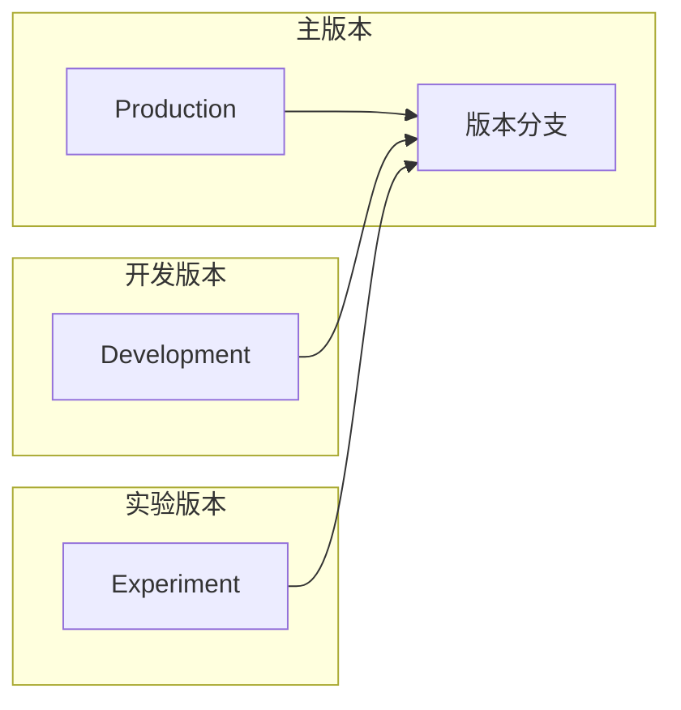
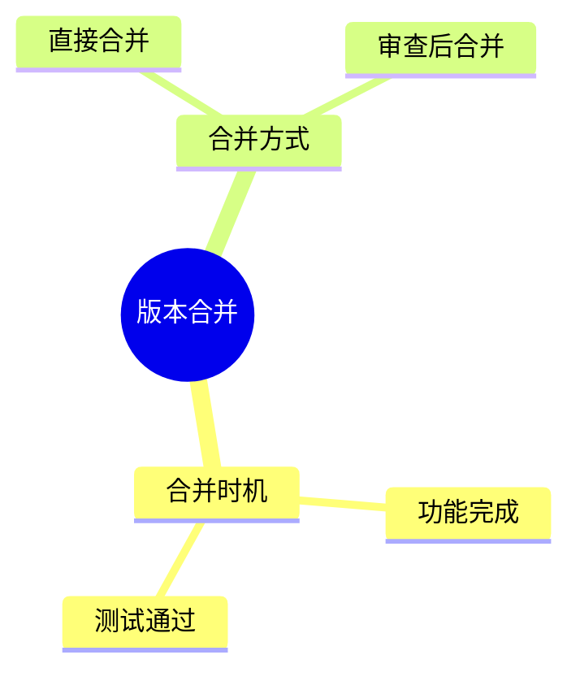

# 图10.39：版本分支管理

## 分支策略

```mermaid
flowchart LR
    subgraph 主版本
        A[Production] --> D[版本分支]
    end
    
    subgraph 开发版本
        B[Development] --> D
    end
    
    subgraph 实验版本
        C[Experiment] --> D
    end
```

## 合并策略

```mermaid
mindmap
  root((版本合并))
    合并时机
      功能完成
      测试通过
    合并方式
      直接合并
      审查后合并
```
