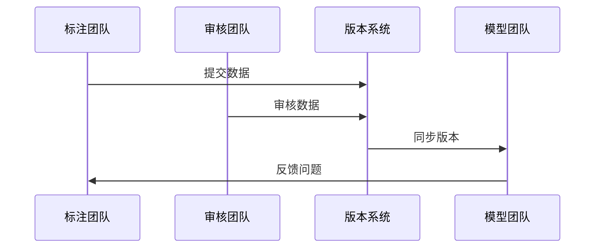
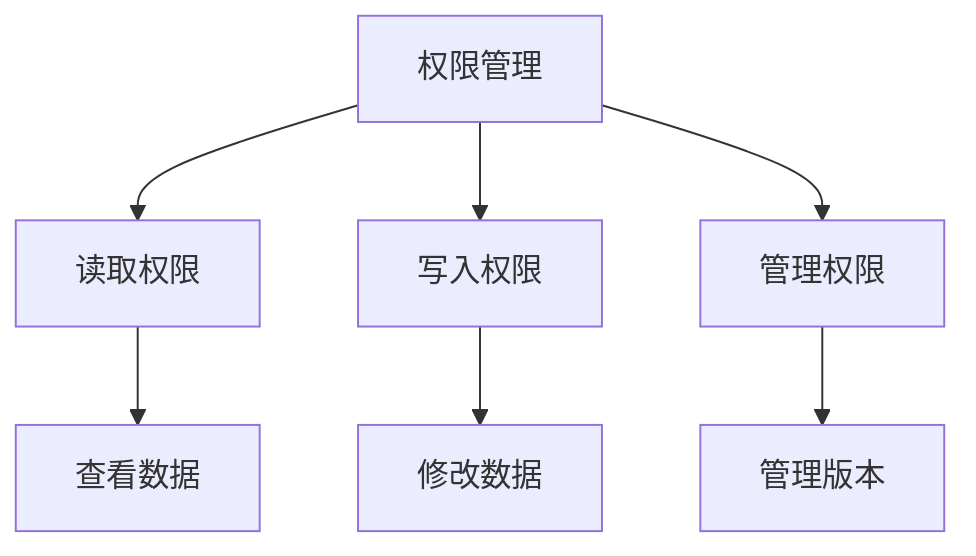
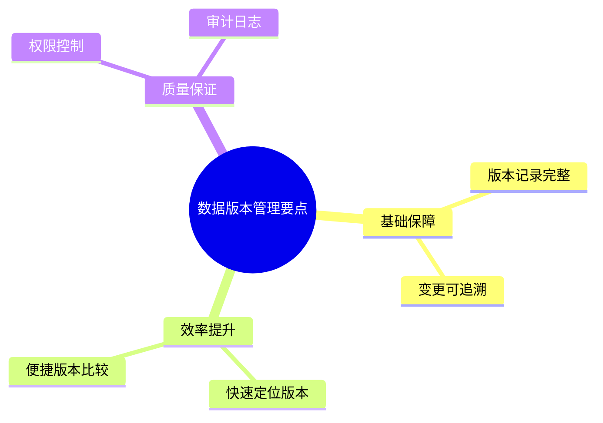

# 图10.40：版本协作管理

## 协作流程

```mermaid
sequenceDiagram
    participant A as 标注团队
    participant B as 审核团队
    participant V as 版本系统
    participant M as 模型团队
    
    A->>V: 提交数据
    B->>V: 审核数据
    V->>M: 同步版本
    M->>A: 反馈问题
```

## 权限管理

```mermaid
flowchart TD
    A[权限管理] --> B[读取权限]
    A --> C[写入权限]
    A --> D[管理权限]
    
    B --> B1[查看数据]
    C --> C1[修改数据]
    D --> D2[管理版本]
```

## 总结

```mermaid
mindmap
  root((数据版本管理要点))
    基础保障
      版本记录完整
      变更可追溯
    效率提升
      快速定位版本
      便捷版本比较
    质量保证
      权限控制
      审计日志
```
